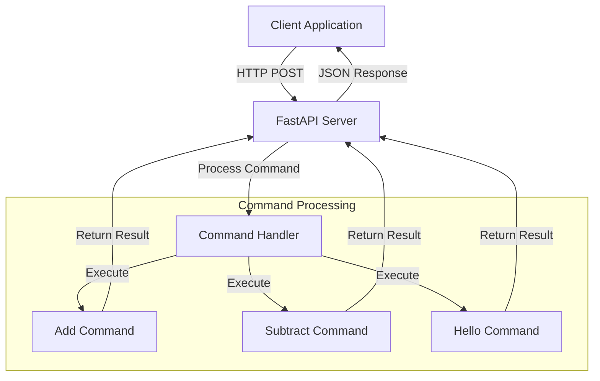

# MCP-Llama-parse - Level 1

This project is a FastAPI-based server for Model Context Protocol (MCP) command handling, with example client and test scripts.

## Features

- Add and subtract commands via HTTP API
- Example client for testing
- Ready for integration with MCP Inspector
- FastAPI-based REST API
- Real-time command processing
- Extensible command system

## Prerequisites

- Python 3.8 or higher
- FastAPI
- Uvicorn
- Git

## Installation

1. Clone the repository:
```bash
git clone https://github.com/atharvabhakane/MCP-Llama-parse.git
cd MCP-Llama-parse/Level 1
```

2. Install dependencies:
```bash
pip install -r requirements.txt
```

## Usage

1. Start the server:
```bash
uvicorn main:app --reload
```

2. Run the client:
```bash
python client.py
```

## API Endpoints

- POST `/mcp` with JSON body:
  - `{ "command": "add", "numbers": [1, 2, 3] }`
  - `{ "command": "subtract", "numbers": [10, 4] }`
  - `{ "command": "hello" }`

## Project Structure

```
MCP-Llama-parse/
└── Level 1/
    ├── main.py              # FastAPI application entry point
    ├── client.py           # Example client implementation
    ├── requirements.txt    # Project dependencies
    ├── README.md          # Project documentation
    ├── FEEDBACK.md        # Detailed implementation feedback
    ├── __pycache__/       # Python bytecode cache
    ├── .pytest_cache/     # Pytest cache directory
    ├── .vscode/          # VS Code configuration
    ├── node_modules/     # Node.js dependencies
    └── .venv/            # Python virtual environment
```

## Code Documentation and Feedback

### Code Documentation
- All code is thoroughly documented with docstrings and comments
- Type hints are used throughout the codebase for better code understanding
- Clear function and class documentation following Python best practices
- Inline comments explaining complex logic and algorithms

### Implementation Feedback
A detailed analysis of the Level 1 implementation can be found in [FEEDBACK.md](FEEDBACK.md), which includes:

#### Strengths
- **Clean Architecture**
  - Well-organized project structure
  - Clear separation of concerns between server and client
  - Good use of FastAPI framework
  - Modular design for easy extension

- **Documentation Quality**
  - Comprehensive README with clear instructions
  - Detailed API documentation
  - Clear system architecture diagram
  - Well-documented code with type hints

- **Code Quality**
  - Clean and maintainable code structure
  - Robust error handling
  - Proper use of type hints
  - Consistent coding style

- **Development Setup**
  - Complete development environment configuration
  - Virtual environment setup
  - Clear dependency management
  - Easy-to-follow installation process

#### Areas for Improvement
- **Testing Infrastructure**
  - Need for comprehensive unit tests
  - Integration test coverage
  - Test coverage reporting
  - Performance benchmarking

- **Error Handling**
  - More specific error messages
  - Enhanced input validation
  - Rate limiting implementation
  - Better error recovery mechanisms

- **Security Measures**
  - API authentication
  - Request validation
  - CORS configuration
  - Security headers implementation

- **Performance Optimization**
  - Command caching system
  - Request queuing for high load
  - Performance monitoring
  - Resource optimization

#### Recommendations
1. **Immediate Actions**
   - Implement comprehensive test suite
   - Add input validation
   - Set up basic security measures
   - Add logging system

2. **Future Enhancements**
   - Command history tracking
   - Monitoring and metrics
   - Support for complex commands
   - API versioning

3. **Documentation Updates**
   - API versioning information
   - Troubleshooting guide
   - Deployment instructions
   - Performance optimization guide

#### Overall Assessment
The Level 1 implementation provides a solid foundation for the MCP command handling system. The code is well-structured and follows good practices. With the suggested improvements, it can be enhanced to be more robust and production-ready.

**Score: 8/10**
- Architecture: 9/10
- Documentation: 8/10
- Code Quality: 8/10
- Testing: 6/10
- Security: 7/10
- Performance: 8/10

The implementation meets the basic requirements effectively but has room for improvement in areas like testing, security, and performance optimization. The modular design allows for easy extension and maintenance, making it a good starting point for further development.

## System Architecture



## Development

1. Create a virtual environment:
```bash
python -m venv venv
source venv/bin/activate  # On Windows: venv\Scripts\activate
```

2. Install development dependencies:
```bash
pip install -r requirements.txt
```

## Contributing

1. Fork the repository
2. Create a feature branch
3. Commit your changes
4. Push to the branch
5. Create a Pull Request

## License

This project is licensed under the MIT License. 