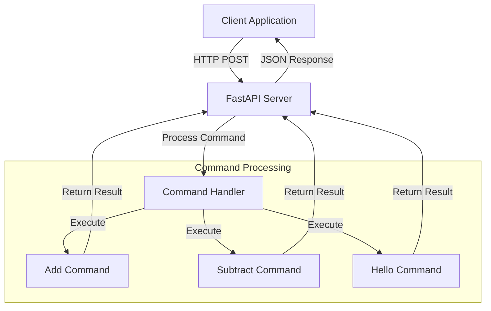

# MCP-Llama-parse - Level 1

This project is a FastAPI-based server for Model Context Protocol (MCP) command handling, with example client and test scripts.

## Features

- Add and subtract commands via HTTP API
- Example client for testing
- Ready for integration with MCP Inspector
- FastAPI-based REST API
- Real-time command processing
- Extensible command system

## Prerequisites

- Python 3.8 or higher
- FastAPI
- Uvicorn
- Git

## Installation

1. Clone the repository:
```bash
git clone https://github.com/atharvabhakane/MCP-Llama-parse.git
cd MCP-Llama-parse/Level 1
```

2. Install dependencies:
```bash
pip install -r requirements.txt
```

## Usage

1. Start the server:
```bash
uvicorn main:app --reload
```

2. Run the client:
```bash
python client.py
```

## API Endpoints

- POST `/mcp` with JSON body:
  - `{ "command": "add", "numbers": [1, 2, 3] }`
  - `{ "command": "subtract", "numbers": [10, 4] }`
  - `{ "command": "hello" }`

## Project Structure

```
MCP-Llama-parse/
└── Level 1/
    ├── main.py              # FastAPI application entry point
    ├── client.py           # Example client implementation
    ├── requirements.txt    # Project dependencies
    ├── README.md          # Project documentation
    ├── __pycache__/       # Python bytecode cache
    ├── .pytest_cache/     # Pytest cache directory
    ├── .vscode/          # VS Code configuration
    ├── node_modules/     # Node.js dependencies
    └── .venv/            # Python virtual environment
```

## System Architecture



## Development

1. Create a virtual environment:
```bash
python -m venv venv
source venv/bin/activate  # On Windows: venv\Scripts\activate
```

2. Install development dependencies:
```bash
pip install -r requirements.txt
```

## Contributing

1. Fork the repository
2. Create a feature branch
3. Commit your changes
4. Push to the branch
5. Create a Pull Request

## License

This project is licensed under the MIT License. 