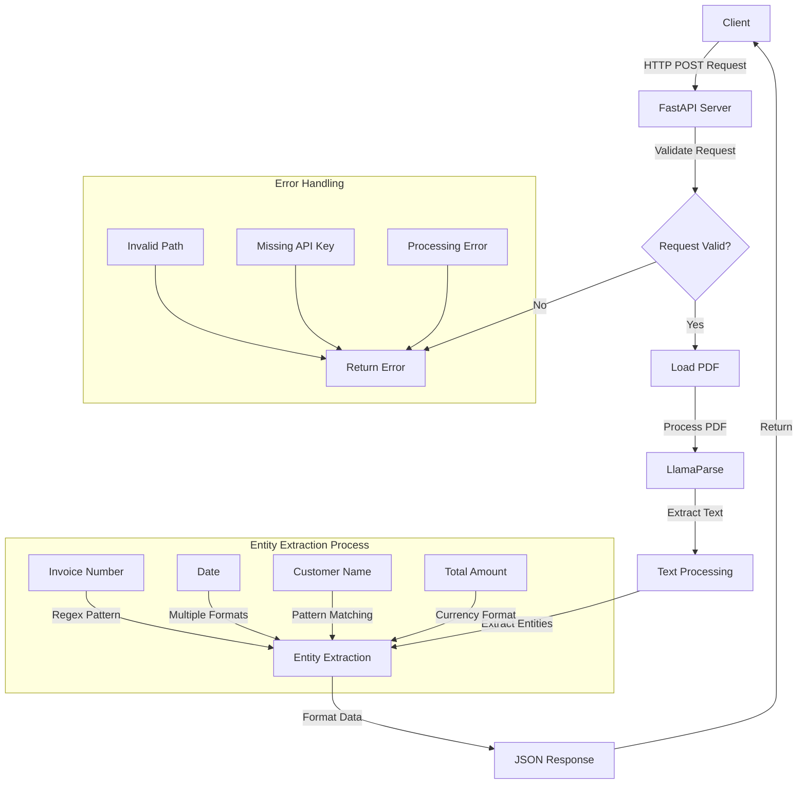
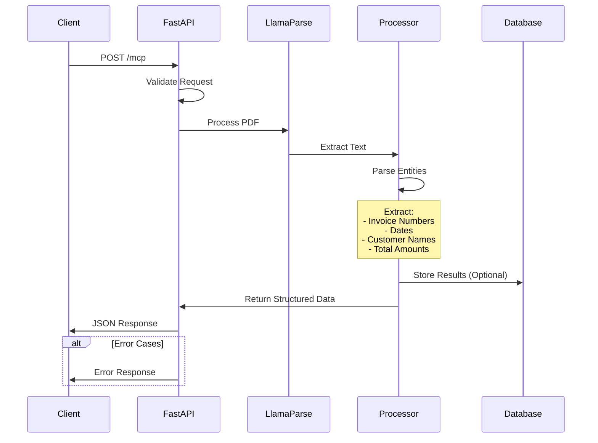

# Invoice Processing System

A FastAPI-based system for processing and extracting information from invoice PDFs using LlamaParse.

## Overview

This system provides an API endpoint that can extract structured information from invoice PDFs, including:
- Invoice Numbers
- Dates
- Customer Names
- Total Amounts

## System Architecture

### High-Level Flow


### Detailed Process Flow


## Prerequisites

- Python 3.8+
- FastAPI
- LlamaParse
- uvicorn
- python-dotenv

## Installation

1. Clone the repository:
```bash
git clone <repository-url>
cd <repository-name>
```

2. Install dependencies:
```bash
pip install -r requirements.txt
```

3. Create a `.env` file in the root directory:
```
LLAMA_CLOUD_API_KEY=your_api_key_here
```

## Usage

1. Start the FastAPI server:
```bash
uvicorn main:app --reload
```

2. Access the API documentation at `http://localhost:8000/docs`

3. Make a POST request to `/mcp` endpoint with the following JSON body:
```json
{
  "command": "extract",
  "document_path": "path/to/your/invoice.pdf",
  "entities": ["invoice_number", "date", "customer", "total"]
}
```

## API Documentation

### POST /mcp

Extracts information from invoice PDFs.

#### Request Body
```json
{
  "command": "extract",
  "document_path": "string",
  "entities": ["string"]
}
```

#### Response
```json
{
  "invoices": [
    {
      "invoice_number": "INV-123",
      "date": "2024-03-20",
      "customer": "Company Name",
      "total": "$1,234.56"
    }
  ]
}
```

## Code Structure

### main.py
- FastAPI application setup
- MCP endpoint implementation
- Entity extraction logic

### Key Functions

#### extract_invoice_data(text: str) -> List[Dict]
Extracts and groups invoice data from text.
- Processes invoice numbers
- Extracts dates in multiple formats
- Identifies customer information
- Calculates total amounts

#### handle_mcp(request: MCPRequest)
Handles MCP requests:
- Validates input
- Processes PDF using LlamaParse
- Extracts entities
- Returns structured response

## Error Handling

The system handles various error cases:
- Missing API key
- Invalid file paths
- PDF processing errors
- Entity extraction failures

## Performance Considerations

- Efficient text processing using regex
- Structured data extraction
- Consistent entity ordering
- Multiple format support

## Security

- API key management through environment variables
- Input validation
- Error message sanitization

## Contributing

1. Fork the repository
2. Create a feature branch
3. Commit your changes
4. Push to the branch
5. Create a Pull Request

## License

[Your License Here]

## Support

For support, please [contact details or issue tracker information] 