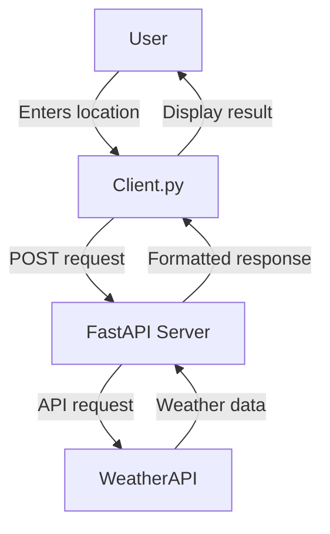

# MCP Weather Service (Level 2)

A simple weather service that allows users to get current weather information for any location using the WeatherAPI.

## 🚀 Features

- Get current weather information for any location
- Simple command-line interface
- RESTful API endpoint
- Error handling and validation
- Environment variable support for API keys

## 📋 Prerequisites

- Python 3.7+
- FastAPI
- Requests
- python-dotenv
- WeatherAPI account and API key

## 🔧 Installation

1. Clone the repository
2. Install the required packages:
```bash
pip install fastapi uvicorn requests python-dotenv
```
3. Create a `.env` file in the project root and add your WeatherAPI key:
```
WEATHER_API_KEY=your_api_key_here
```

## 🏗️ Project Structure

```
.
├── main.py          # FastAPI server implementation
├── client.py        # Command-line client
├── .env            # Environment variables (create this)
└── README.md       # This file
```

## 🔄 Flow



## 🚀 Usage

1. Start the server:
```bash
uvicorn main:app --reload
```

2. In a separate terminal, run the client:
```bash
python client.py
```

3. Enter a location when prompted

## 📡 API Endpoint

### POST /mcp

Request body:
```json
{
    "command": "weather",
    "location": "London"
}
```

Response:
```json
{
    "location": "London",
    "country": "United Kingdom",
    "temperature_c": 15.6,
    "condition": "Partly cloudy"
}
```

## ⚠️ Error Handling

The service handles various error cases:
- Missing location parameter
- Invalid API responses
- Network errors
- Invalid commands

## 🔒 Security

- API keys are stored in environment variables
- Input validation using Pydantic models
- Error messages don't expose sensitive information

## 🛠️ Development

To modify or extend the service:
1. The main server logic is in `main.py`
2. The client interface is in `client.py`
3. Add new commands by extending the `handle_mcp` function

## 📝 License

This project is open source and available under the MIT License. 