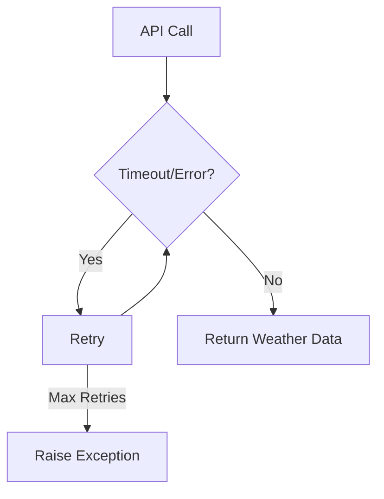
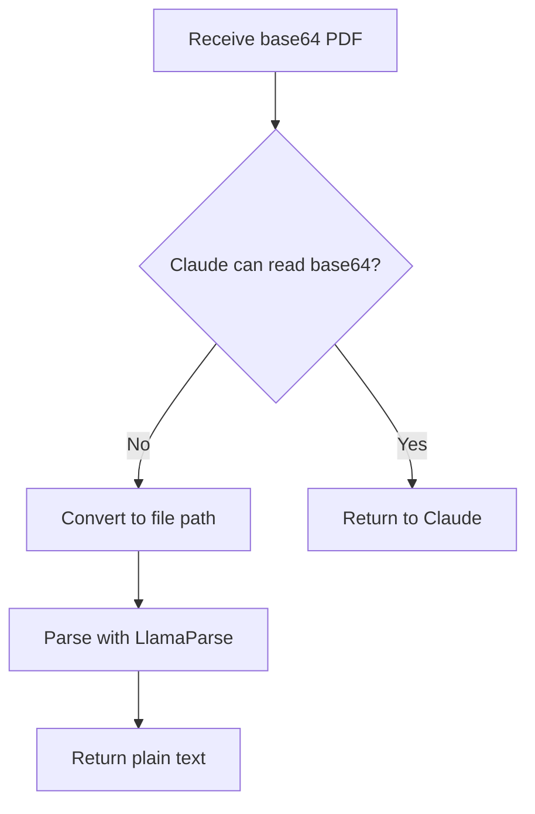
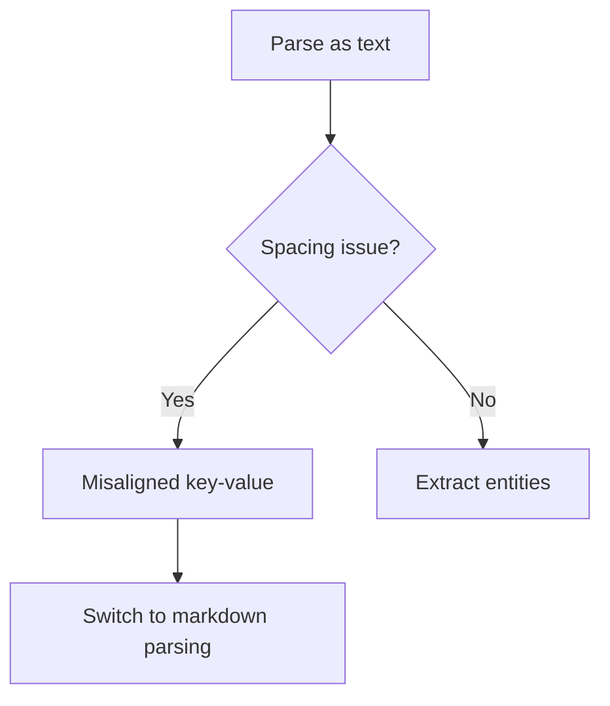
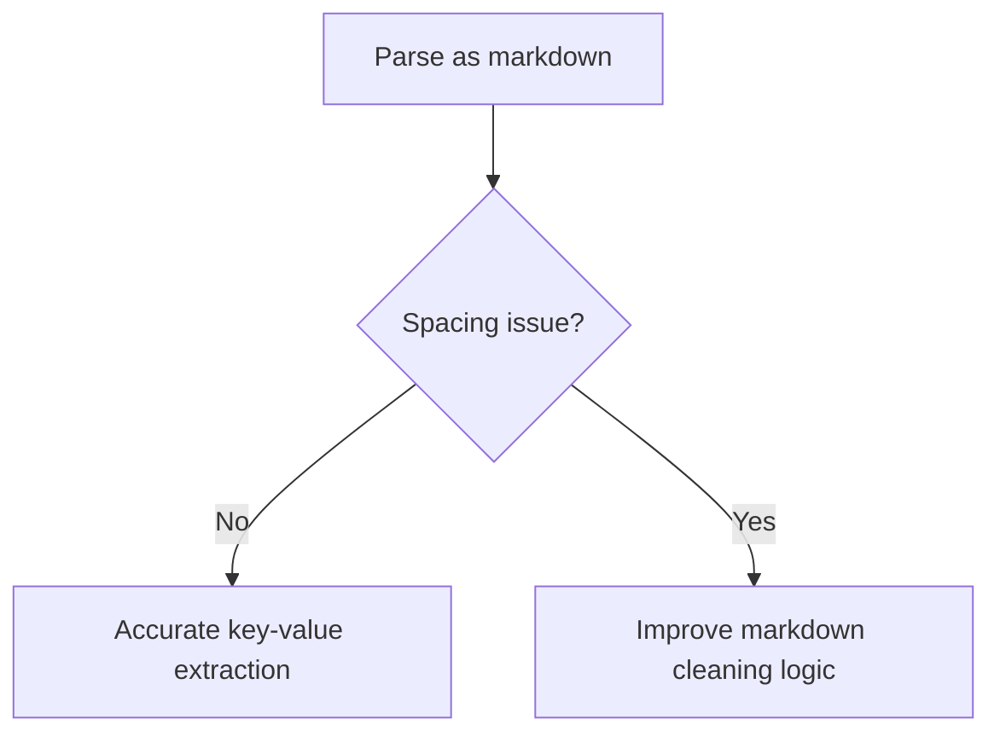

# 📄 MCP Project: Multi-Level Document Processing System

This README provides a comprehensive overview of the **MCP (Model Context Protocol) Project**, which simulates an end-to-end document processing system using FastMCP and LlamaParse. The project is organized into **five progressive levels**, each introducing new features, tools, and optimizations for intelligent document processing.

---

## 🚀 Project Overview

The MCP project demonstrates how incremental improvements in architecture, tool integration, and data handling can dramatically enhance the performance and accuracy of document processing systems. Each level builds upon the previous, addressing real-world challenges and implementing solutions that improve usability, speed, and reliability.

---

## 📘 Level 1: Calculator MCP Tool

### 🧰 Tools Used
- **FastMCP**: For building the MCP server and exposing tools.
- **Python async**: For non-blocking tool execution.

### 📝 Motivation & Approach
The goal was to create a simple MCP server that could perform basic arithmetic operations. This served as a foundation for understanding FastMCP's tool registration and async event loop.

### ⚙️ Key Tool Implementation

```python
@mcp.tool()
async def add(numbers: list[float]) -> float:
    """Add a list of numbers."""
    return sum(numbers)

@mcp.tool()
async def subtract(numbers: list[float]) -> float:
    """Subtract a list of numbers in order."""
    result = numbers[0]
    for n in numbers[1:]:
        result -= n
    return result
```

### 🧩 Error & Solution

**Error:**  
- None at this stage (basic functionality).

**Learning:**  
- How to define and expose tools using FastMCP.
- Understanding FastMCP's request structure and event loop.

---

## 📘 Level 2: Weather Tool Integration

### 🧰 Tools Used
- **FastMCP**
- **open-meteo API** (or mocked data)
- **httpx**: For async HTTP requests.

### 📝 Motivation & Approach
To demonstrate external API integration, we added a weather tool that fetches real-time weather data for a given city.

### ⚙️ Key Tool Implementation

```python
import httpx

@mcp.tool()
async def get_weather(city_name: str) -> dict:
    """Fetch current weather for a city."""
    url = f"https://api.open-meteo.com/v1/forecast?city={city_name}&current_weather=true"
    async with httpx.AsyncClient(timeout=5.0) as client:
        response = await client.get(url)
        response.raise_for_status()
        return response.json()
```

### 🧩 Error & Solution

**Error:**  
- API timeouts and unreliable responses.

**Solution:**  
- Implemented retries and set timeouts using `httpx`.

```python
import asyncio

async def fetch_with_retries(url, retries=3):
    for attempt in range(retries):
        try:
            async with httpx.AsyncClient(timeout=5.0) as client:
                response = await client.get(url)
                response.raise_for_status()
                return response.json()
        except Exception as e:
            if attempt == retries - 1:
                raise
            await asyncio.sleep(1)
```

**Learning:**  
- How to interact with external APIs.
- Error handling with retries and fallback logic.

#### 🗺️ Error Flowchart



---

## 📘 Level 3: IDP Using Claude on Cursor

### 🧰 Tools Used
- **FastMCP**
- **Cursor IDE**
- **Claude (via Cursor integration)**
- **LlamaParse**

### 📝 Motivation & Approach
To leverage Claude's strong document understanding, we built a tool that returns the full parsed text of a document, making it easy for Claude to process.

### ⚙️ Key Tool Implementation

```python
@mcp.tool()
async def get_full_text(pdf_path: str) -> str:
    """Return the full text of a PDF using LlamaParse."""
    from llamaparse import LlamaParse
    parser = LlamaParse()
    return parser.parse(pdf_path)
```

### 🧩 Error & Solution

**Error:**  
- Claude could not read base64 data directly.

**Solution:**  
- Used LlamaParse to decode PDF and return plain text.

```python
# Instead of passing base64, save PDF and pass file path to LlamaParse
```

**Learning:**  
- Claude works best with full context.
- Parsing text externally using LlamaParse SDK is more stable.

#### 🗺️ Error Flowchart



---

## 📘 Level 4: SDK-based Entity Extraction with Text Parsing

### 🧰 Tools Used
- **FastMCP**
- **LlamaParse** (text result_type)

### 📝 Motivation & Approach
To extract entities directly, we parsed documents as plain text and used string processing to find key-value pairs.

### ⚙️ Key Tool Implementation

```python
@mcp.tool()
async def extract_entities(pdf_path: str, entities: list[str]) -> dict:
    """Extract entities from parsed text."""
    text = LlamaParse().parse(pdf_path, result_type="text")
    result = {}
    for entity in entities:
        for line in text.splitlines():
            if entity.lower() in line.lower():
                result[entity] = line
    return result
```

### 🧩 Error & Solution

**Error:**  
- Text parsing caused misaligned detection due to spacing issues.

**Spacing Issue Example:**
```
Invoice           Number: INV-12345
```
became:
```
Invoice
Number: INV-12345
```

**Solution:**  
- Needed a more structure-preserving format (see Level 5).

**Improvement:**  
- Switched from `transport="stdio"` to `transport="http-streaming"` for faster, more stable communication.

```python
mcp.run(transport="http-streaming")
```

**Learning:**  
- Plain text parsing is unreliable for structured data.

#### 🗺️ Error Flowchart



---

## 📘 Level 5: Markdown Format + Robust Entity Extraction

### 🧰 Tools Used
- **FastMCP**
- **LlamaParse** with `result_type="markdown"`

### 📝 Motivation & Approach
To solve spacing and alignment issues, we switched to markdown output, which preserves document structure and formatting.

### ⚙️ Key Tool Implementation

```python
@mcp.tool()
async def extract_entities_markdown(pdf_path: str, entities: list[str]) -> dict:
    """Extract entities from markdown-formatted text."""
    text = LlamaParse().parse(pdf_path, result_type="markdown")
    result = {}
    for line in text.splitlines():
        clean_line = line.replace("**", "").strip()
        for entity in entities:
            if entity.lower() in clean_line.lower():
                result[entity] = clean_line
    return result
```

**Markdown Example:**
```
**Invoice Number:** INV-12345
```

**Server Enhancement:**
```python
mcp.run(transport="streamable-http")
```

**Learning:**  
- Markdown improved key-value accuracy and solved spacing issues.
- HTTP streaming reduced response time and improved reliability.

#### 🗺️ Error Flowchart



---

## 📦 Llamaparse-all: Dynamic PDF Extraction Server

**Llamaparse-all** is an advanced, standalone module in this repository that provides a dynamic PDF extraction server using LlamaParse. It supports runtime schema generation and flexible PDF input (file path or base64), making it ideal for integration with Claude or similar frontends.

### ✨ Features
- **Dynamic Schema Extraction:** Define entities to extract at runtime—no hardcoding required.
- **Flexible PDF Input:** Accepts both file paths and base64-encoded PDFs.
- **Agent Management:** Reuses or creates LlamaParse agents as needed for each extraction.
- **Robust Error Handling:** Handles invalid input, agent creation issues, and file cleanup.

### 🛠️ Requirements
- llama-cloud-services
- python-dotenv
- fastapi
- uvicorn
- mcp

Install with:
```bash
pip install -r Llamaparse-all/requirements.txt
```

### 🚦 How It Works
- Receives an extraction request with a list of entities, agent name, and PDF (as path or base64).
- Dynamically builds a Pydantic schema for the requested entities.
- Reuses or creates a LlamaParse agent for extraction.
- Returns extracted data in a structured format.

### 🏗️ Project Structure
```
Llamaparse-all/
├── server.py          # Main server and extraction logic
├── requirements.txt   # Python dependencies
├── README.md          # Detailed usage and design notes
```

### 🚀 Example Usage
**Python:**
```python
import requests
url = "http://localhost:8000/tools/create_agent_and_extract"
payload = {
    "entities": ["InvoiceNumber", "TotalAmount", "Date"],
    "agent_name": "invoice_extractor",
    "pdf_path": "/path/to/invoice.pdf"  # or use 'pdf_base64' for base64 input
}
response = requests.post(url, json=payload)
print(response.json())
```
**curl:**
```bash
curl -X POST http://localhost:8000/tools/create_agent_and_extract \
  -H "Content-Type: application/json" \
  -d '{
    "entities": ["Name", "Amount"],
    "agent_name": "my_agent",
    "pdf_path": "/path/to/file.pdf"
  }'
```

**See `Llamaparse-all/README.md` for full details, advanced usage, and troubleshooting.**

---

## 🧠 Summary Table: Errors and Fixes

| Level | Error               | Fix                                        |
| ----- | ------------------- | ------------------------------------------ |
| 2     | API timeouts        | Added retries & set timeout using httpx    |
| 3     | base64 not accepted | Converted PDF to path & returned full text |
| 4     | Text spacing issues | Switched to markdown parsing               |
| 5     | Tool latency        | Used `http-streaming` transport            |

---

## 🔄 Flow of Improvements


---

## 🏆 Key Takeaways

- **Small changes in input format and transport can dramatically improve performance.**
- Markdown improved key-value accuracy and solved spacing issues.
- HTTP streaming reduced response time and improved reliability.
- Each level demonstrates a clear, practical improvement over the previous.

---

## 🔗 GitHub Repository

[GitHub Repository](https://github.com/atharvabhakane)