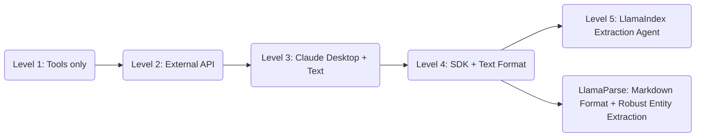
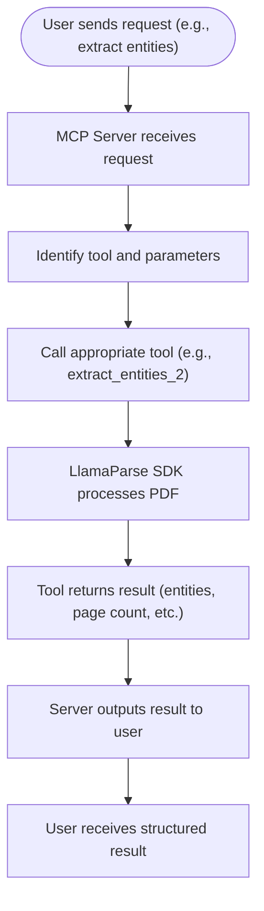

# 📄 MCP Project: Multi-Level Document Processing System

Welcome! I'm excited to share my journey building the **MCP (Model Context Protocol) Project**—a hands-on, multi-level exploration of document processing using FastMCP and **LlamaIndex**. My goal with this project was to demystify intelligent document processing, break it down into approachable steps, and make it easy for anyone (including total beginners) to learn, experiment, and contribute.

---

## 🦙 What is LlamaIndex

**LlamaIndex** is a powerful document parsing tool that extracts structured data and text from PDFs and other documents. It preserves formatting, supports multiple output types (like plain text and markdown), and is especially useful for building AI-powered document workflows. I chose LlamaParse for its reliability, flexibility, and ease of integration with Python projects.

---

## 🚀 Why I Built This Project (And What You'll Learn)

When I first started working with document processing, I found most tutorials either too simple or overwhelmingly complex. I wanted a resource that would guide me (and others) from the basics to advanced techniques, showing not just the "how" but also the "why" behind each improvement.

This project is organized into **five progressive levels**. Each level introduces new features, tools, and real-world solutions to common problems—so you can see how small changes can make a big difference. Whether you're a beginner or looking to deepen your understanding, you'll find clear explanations, practical code, and honest notes about what worked, what didn't, and how I fixed it.

---

## 📘 Level 1: Calculator MCP Tool

### Why Start Here?
I wanted to start with something super simple—a calculator! This level is all about getting comfortable with FastMCP, async Python, and the basics of exposing tools. If you're new to MCP or just want to see how the pieces fit together, this is the perfect place to begin.

### What You'll Build
A tiny server that can add or subtract numbers (and greet you!). It's not fancy, but it's a great way to see how MCP tools work end-to-end.

### What Happens Under the Hood?
- The server listens for requests (like "add 5 and 3").
- It calls the right tool (add, subtract, or hello).
- It returns the result as JSON.

### Why This Matters
This level gave me a solid foundation for everything that comes next. If you can get this running, you're ready for more advanced tools!

📋 **Feedback & Learning Notes:** Check out [`level-1/FEEDBACK.md`](level-1/FEEDBACK.md) for detailed insights, challenges faced, and solutions discovered during development. For more learning on errors and troubleshooting, refer to the feedback files.

---

## 📘 Level 2: Weather Tool Integration

### Why Add Weather?
After getting the calculator working, I wanted to try something a bit more real-world—so I picked weather! This level shows how to connect your MCP server to an external API, handle async HTTP requests, and deal with real data (and real errors).

### What You'll Build
A tool that fetches the current weather for any city you ask for. It's a great way to learn about API integration and error handling.

### What You'll Learn
- How to call external APIs from your MCP tool
- How to handle timeouts, retries, and errors gracefully
- How to return structured data to the user

### Why This Matters
This step taught me how to make my tools actually useful—by connecting them to real-world data. Plus, I learned a lot about handling things when they go wrong (see the error flowchart below!).

### 🧩 Error & Solution

**Error:**  
- API timeouts and unreliable responses.

**Solution:**  
- Implemented retries and set timeouts using `httpx`.

```python
import asyncio

async def fetch_with_retries(url, retries=3):
    for attempt in range(retries):
        try:
            async with httpx.AsyncClient(timeout=5.0) as client:
                response = await client.get(url)
                response.raise_for_status()
                return response.json()
        except Exception as e:
            if attempt == retries - 1:
                raise
            await asyncio.sleep(1)
```

**Learning:**  
- How to interact with external APIs.
- Error handling with retries and fallback logic.

📋 **Feedback & Learning Notes:** Check out [`level-2/FEEDBACK.md`](level-2/FEEDBACK.md) for detailed insights, challenges faced, and solutions discovered during development. For more learning on errors and troubleshooting, refer to the feedback files.

---

## 📘 Level 3: IDP Using Claude Desktop and AI Tools

### Why Use Claude Desktop, LlamaIndex, and AI Tools?
At this point, I wanted to see how far I could push document understanding by combining my MCP server with powerful AI tools. **LlamaIndex** is used here to extract the full text from PDFs, making it easy for Claude Desktop (or any AI assistant) to process and answer questions about your documents. LlamaParse ensures the text is clean and structured for downstream AI processing.

### What You'll Build
A tool that returns the entire text of a PDF, making it easy for Claude Desktop (or any AI) to process and answer questions about your documents. **LlamaIndex** is the backbone for parsing the PDF content.

### What You'll Learn
- How to connect your MCP server to AI tools like Claude Desktop
- How to return large document content for downstream processing
- How to handle file input and output in a robust way

### Why This Matters
This level opened my eyes to how much more you can do when you combine MCP with AI. Suddenly, you can ask questions about your documents, extract insights, and automate all kinds of workflows.

### 🧩 Error & Solution

**Error:**  
- Claude Desktop could not read base64 data directly.

**Solution:**  
- Used LlamaIndex to decode PDF and return plain text.

```python
# Instead of passing base64, save PDF and pass file path to LlamaIndex
```

**Learning:**  
- Claude Desktop works best with full context.
- Parsing text externally using LlamaIndex SDK is more stable.

📋 **Feedback & Learning Notes:** Check out [`level-3/FEEDBACK.md`](level-3/FEEDBACK.md) for detailed insights, challenges faced, and solutions discovered during development. For more learning on errors and troubleshooting, refer to the feedback files.

---

## 📘 Level 4: SDK-based Entity Extraction with Text Parsing

### Why Entity Extraction with LlamaIndex?
After seeing the power of full-text extraction, I wanted to make my tools smarter—so I added entity extraction! This level is all about pulling out specific pieces of information (like invoice numbers or dates) from your documents. **LlamaIndex** is used to convert PDFs to text, which is then processed to extract entities.

### What You'll Build
A tool that takes a PDF and a list of entities you care about, and returns just those values. It's a great way to automate data entry or build document-driven workflows. **LlamaIndex** handles the parsing step.

### What You'll Learn
- How to parse documents as plain text
- How to extract key-value pairs using string processing
- Why text parsing can be tricky (see the spacing issue below!)

### Why This Matters
This level taught me that real-world documents are messy! I ran into spacing and alignment issues, which led me to look for better solutions in the next level.

### 🧩 Error & Solution

**Error:**  
- Text parsing caused misaligned detection due to spacing issues.

**Spacing Issue Example:**
```
Invoice           Number: INV-12345
```
became:
```
Invoice
Number: INV-12345
```

**Solution:**  
- Needed a more structure-preserving format (see Level 5).

**Improvement:**  
- Switched from `transport="stdio"` to `transport="http-streaming"` for faster, more stable communication.

```python
mcp.run(transport="http-streaming")
```

**Learning:**  
- Plain text parsing is unreliable for structured data.

📋 **Feedback & Learning Notes:** Check out [`level-4/FEEDBACK.md`](level-4/FEEDBACK.md) for detailed insights, challenges faced, and solutions discovered during development. For more learning on errors and troubleshooting, refer to the feedback files.

---

## 📦 Level-5: Dynamic PDF Extraction Server

### Why Level-5?
After building the previous levels, I wanted a truly flexible, production-ready solution. LlamaIndex-all is my answer: a dynamic PDF extraction server that lets you define what you want to extract at runtime. No more hardcoding schemas—just tell it what you need! **LlamaIndex** is used for all document parsing and extraction, supporting both file path and base64 input.

### What You'll Build
A server that can extract any set of entities from any PDF, using either a file path or base64 input. It manages agents for you and handles all the tricky parts behind the scenes, with **LlamaIndex** doing the heavy lifting for parsing and extraction.

### What You'll Learn
- How to build a dynamic, schema-free extraction server
- How to handle both file path and base64 PDF input
- How to manage agents and clean up resources automatically

### Why This Matters
This module is the culmination of everything I learned—it's robust, flexible, and ready for real-world use. If you want to build your own document extraction service, start here!

### 🚦 How It Works
- Receives an extraction request with a list of entities, agent name, and PDF (as path or base64).
- Dynamically builds a Pydantic schema for the requested entities.
- Reuses or creates a LlamaIndex agent for extraction.
- Returns extracted data in a structured format.

### 🚀 Example Usage
**Python:**
```python
import requests
url = "http://localhost:8000/tools/create_agent_and_extract"
payload = {
    "entities": ["InvoiceNumber", "TotalAmount", "Date"],
    "agent_name": "invoice_extractor",
    "pdf_path": "/path/to/invoice.pdf"  # or use 'pdf_base64' for base64 input
}
response = requests.post(url, json=payload)
print(response.json())
```
**curl:**
```bash
curl -X POST http://localhost:8000/tools/create_agent_and_extract \
  -H "Content-Type: application/json" \
  -d '{
    "entities": ["Name", "Amount"],
    "agent_name": "my_agent",
    "pdf_path": "/path/to/file.pdf"
  }'
```
📋 **Feedback & Learning Notes:** Check out [`level-5/FEEDBACK.md`](level-5/FEEDBACK.md) for detailed insights, challenges faced, and solutions discovered during development. For more learning on errors and troubleshooting, refer to the feedback files.

---

## 📘 LlamaParse: Markdown Format + Robust Entity Extraction

### Why Markdown, LlamaIndex, and Streaming?
After struggling with text parsing, I realized I needed a format that preserved the structure of my documents. **LlamaIndex** turned out to be perfect—it keeps headings, bold text, and key-value pairs clear. Plus, switching to HTTP streaming made everything faster and more reliable.

### What You'll Build
A tool that extracts entities from PDFs using markdown-formatted output from **LlamaIndex**, so you get accurate, well-structured results every time.

### What You'll Learn
- How to use markdown to preserve document structure
- How to extract entities more reliably
- How HTTP streaming improves tool performance

### Why This Matters
This level finally solved the spacing and misalignment headaches I had before. Now, my entity extraction is accurate and fast, and the server is ready for real-world use!

**Markdown Example:**
```
**Invoice Number:** INV-12345
```

**Server Enhancement:**
```python
mcp.run(transport="streamable-http")
```

**Learning:**  
- Markdown improved key-value accuracy and solved spacing issues.
- HTTP streaming reduced response time and improved reliability.

📋 **Feedback & Learning Notes:** Check out [`level-5/LlamaParse/FEEDBACK.md`](level-5/LlamaParse/FEEDBACK.md) for detailed insights, challenges faced, and solutions discovered during development. For more learning on errors and troubleshooting, refer to the feedback files.

---

## 🔄 Flow of Improvements



---

## 🟢 Success Workflow: End-to-End Flow

Here's how a typical successful request flows through the system, from the user's perspective to the final result:



---

## 🏆 Key Takeaways

- **Small changes in input format and transport can dramatically improve performance.**
- Markdown improved key-value accuracy and solved spacing issues.
- HTTP streaming reduced response time and improved reliability.
- Each level demonstrates a clear, practical improvement over the previous.

---

## 📚 Resources

- [Model Context Protocol (MCP)](https://modelcontextprotocol.io/introduction)
- [LlamaIndex](https://docs.cloud.llamaindex.ai/)

