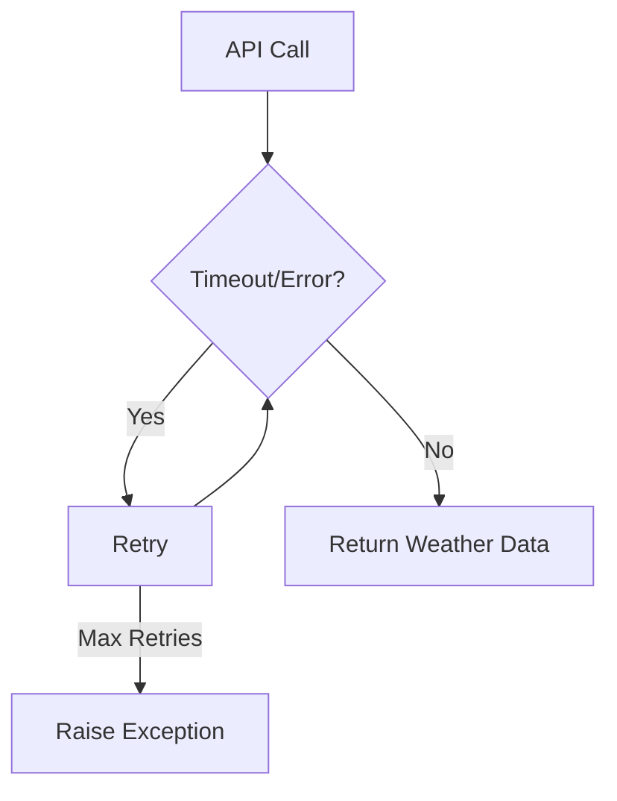
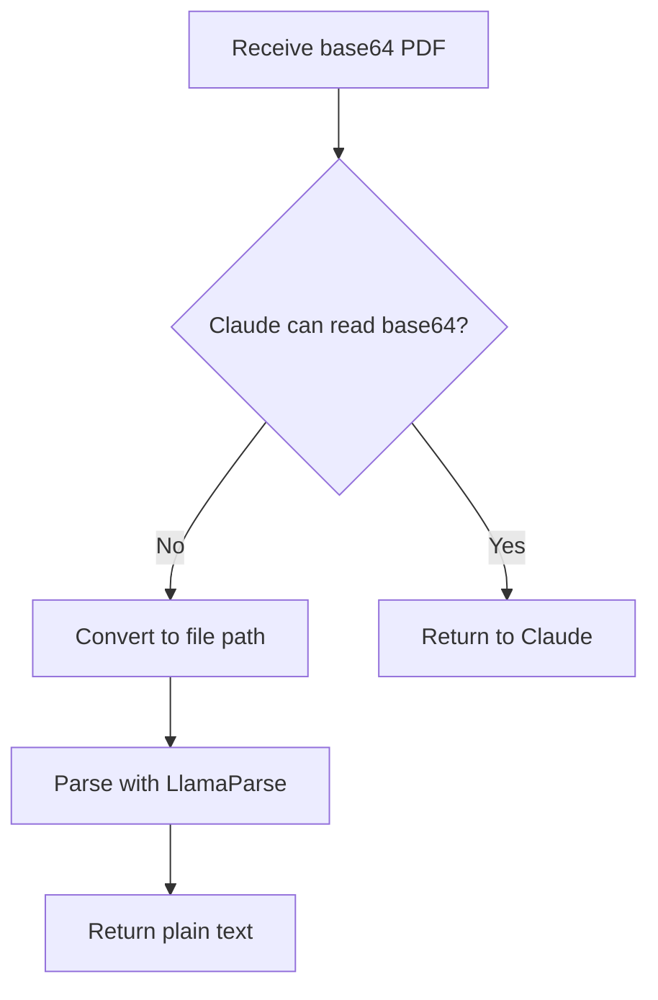
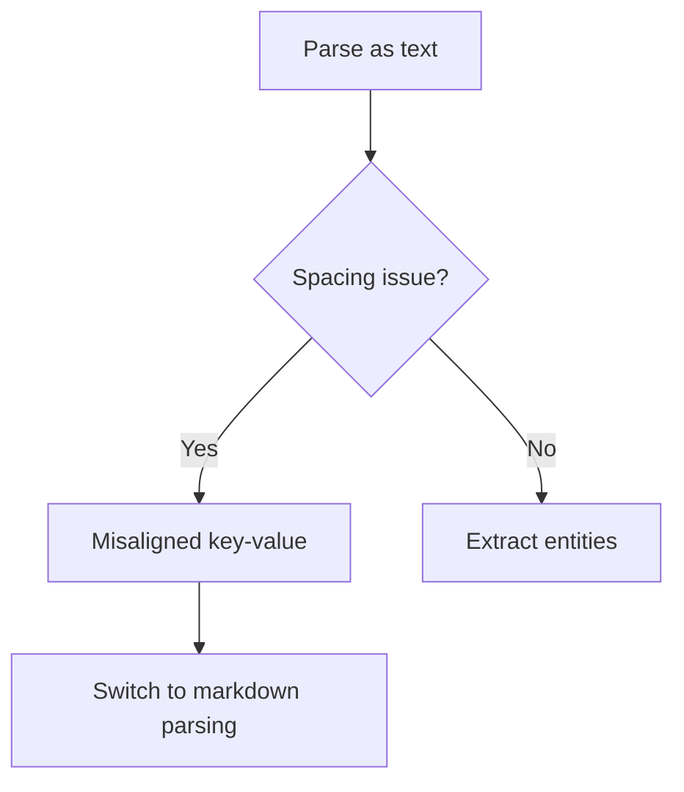
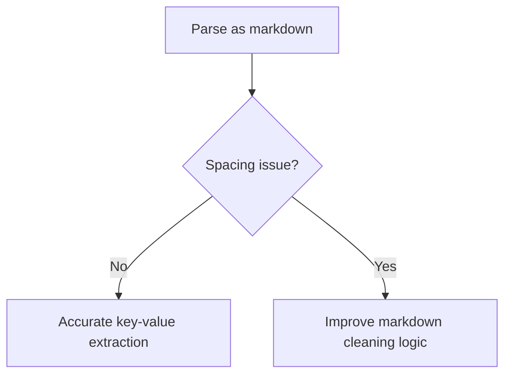

# 📄 MCP Project: Multi-Level Document Processing System

Welcome! I'm excited to share my journey building the **MCP (Model Context Protocol) Project**—a hands-on, multi-level exploration of document processing using FastMCP and LlamaParse. My goal with this project was to demystify intelligent document processing, break it down into approachable steps, and make it easy for anyone (including total beginners) to learn, experiment, and contribute.

---

## 🚀 Why I Built This Project (and What You'll Learn)

When I first started working with document processing, I found most tutorials either too simple or overwhelmingly complex. I wanted a resource that would guide me (and others) from the basics to advanced techniques, showing not just the "how" but also the "why" behind each improvement.

This project is organized into **five progressive levels**. Each level introduces new features, tools, and real-world solutions to common problems—so you can see how small changes can make a big difference. Whether you're a beginner or looking to deepen your understanding, you'll find clear explanations, practical code, and honest notes about what worked, what didn't, and how I fixed it.

---

## 📘 Level 1: Calculator MCP Tool

### Why Start Here?
I wanted to start with something super simple—a calculator! This level is all about getting comfortable with FastMCP, async Python, and the basics of exposing tools. If you're new to MCP or just want to see how the pieces fit together, this is the perfect place to begin.

### 🧰 Tools Used
- **FastMCP**: For building the MCP server and exposing tools.
- **Python async**: For non-blocking tool execution.

### What You'll Build
A tiny server that can add or subtract numbers (and greet you!). It's not fancy, but it's a great way to see how MCP tools work end-to-end.

### How to Run It (Step-by-Step)
1. **Install FastMCP:**
   ```bash
   pip install fastmcp
   ```
2. **Start the server:**
   ```bash
   python level-1/server.py
   ```
3. **Test it!** You can use MCP Inspector, Cursor, or even send a JSON payload directly. For example:
   ```json
   { "tool": "add", "args": { "a": 5, "b": 3 } }
   ```
   You'll get back:
   ```json
   { "result": 8 }
   ```

### What Happens Under the Hood?
- The server listens for requests (like "add 5 and 3").
- It calls the right tool (add, subtract, or hello).
- It returns the result as JSON.

### Why This Matters
This level gave me a solid foundation for everything that comes next. If you can get this running, you're ready for more advanced tools!

### Key Tool Implementation

```python
@mcp.tool()
async def add(numbers: list[float]) -> float:
    """Add a list of numbers."""
    return sum(numbers)

@mcp.tool()
async def subtract(numbers: list[float]) -> float:
    """Subtract a list of numbers in order."""
    result = numbers[0]
    for n in numbers[1:]:
        result -= n
    return result
```

### 🧩 Error & Solution

**Error:**  
- None at this stage (basic functionality).

**Learning:**  
- How to define and expose tools using FastMCP.
- Understanding FastMCP's request structure and event loop.

---

## 📘 Level 2: Weather Tool Integration

### Why Add Weather?
After getting the calculator working, I wanted to try something a bit more real-world—so I picked weather! This level shows how to connect your MCP server to an external API, handle async HTTP requests, and deal with real data (and real errors).

### What You'll Build
A tool that fetches the current weather for any city you ask for. It's a great way to learn about API integration and error handling.

### How to Run It (Step-by-Step)
1. **Install dependencies:**
   ```bash
   pip install python-dotenv httpx fastmcp
   ```
2. **Get a WeatherAPI key:**
   - Sign up at https://www.weatherapi.com/ and grab your free API key.
3. **Set up your .env file:**
   ```env
   WEATHER_API_KEY=YOUR_API_KEY
   ```
4. **Start the server:**
   ```bash
   python level-2/weather_server.py
   ```
5. **Test it!**
   Send a request like:
   ```json
   { "tool": "get_weather", "args": { "location": "London" } }
   ```
   You'll get back something like:
   ```json
   { "location": "London", "country": "UK", "temp_c": 18, "condition": "Partly cloudy" }
   ```

### What You'll Learn
- How to call external APIs from your MCP tool
- How to handle timeouts, retries, and errors gracefully
- How to return structured data to the user

### Why This Matters
This step taught me how to make my tools actually useful—by connecting them to real-world data. Plus, I learned a lot about handling things when they go wrong (see the error flowchart below!).

### Key Tool Implementation

```python
import httpx

@mcp.tool()
async def get_weather(city_name: str) -> dict:
    """Fetch current weather for a city."""
    url = f"https://api.open-meteo.com/v1/forecast?city={city_name}&current_weather=true"
    async with httpx.AsyncClient(timeout=5.0) as client:
        response = await client.get(url)
        response.raise_for_status()
        return response.json()
```

### 🧩 Error & Solution

**Error:**  
- API timeouts and unreliable responses.

**Solution:**  
- Implemented retries and set timeouts using `httpx`.

```python
import asyncio

async def fetch_with_retries(url, retries=3):
    for attempt in range(retries):
        try:
            async with httpx.AsyncClient(timeout=5.0) as client:
                response = await client.get(url)
                response.raise_for_status()
                return response.json()
        except Exception as e:
            if attempt == retries - 1:
                raise
            await asyncio.sleep(1)
```

**Learning:**  
- How to interact with external APIs.
- Error handling with retries and fallback logic.

#### 🗺️ Error Flowchart



---

## 📘 Level 3: IDP Using Claude on Cursor

### Why Use Claude and Cursor?
At this point, I wanted to see how far I could push document understanding by combining my MCP server with powerful AI tools. Claude (via Cursor) is amazing at reading and reasoning over documents, so I built a tool that lets it see the full parsed text of any PDF.

### What You'll Build
A tool that returns the entire text of a PDF, making it easy for Claude (or any AI) to process and answer questions about your documents.

### How to Run It (Step-by-Step)
1. **Install requirements:**
   ```bash
   pip install mcp llamaparse
   ```
2. **Start the server:**
   ```bash
   python level-3/simulated_idp.py
   ```
3. **Test it!**
   Send a request like:
   ```json
   { "tool": "get_full_text", "args": { "pdf_path": "path/to/your.pdf" } }
   ```
   You'll get back:
   ```json
   { "result": "Full text of your PDF here..." }
   ```

### What You'll Learn
- How to connect your MCP server to AI tools like Claude
- How to return large document content for downstream processing
- How to handle file input and output in a robust way

### Why This Matters
This level opened my eyes to how much more you can do when you combine MCP with AI. Suddenly, you can ask questions about your documents, extract insights, and automate all kinds of workflows.

### Key Tool Implementation

```python
@mcp.tool()
async def get_full_text(pdf_path: str) -> str:
    """Return the full text of a PDF using LlamaParse."""
    from llamaparse import LlamaParse
    parser = LlamaParse()
    return parser.parse(pdf_path)
```

### 🧩 Error & Solution

**Error:**  
- Claude could not read base64 data directly.

**Solution:**  
- Used LlamaParse to decode PDF and return plain text.

```python
# Instead of passing base64, save PDF and pass file path to LlamaParse
```

**Learning:**  
- Claude works best with full context.
- Parsing text externally using LlamaParse SDK is more stable.

#### 🗺️ Error Flowchart



---

## 📘 Level 4: SDK-based Entity Extraction with Text Parsing

### Why Entity Extraction?
After seeing the power of full-text extraction, I wanted to make my tools smarter—so I added entity extraction! This level is all about pulling out specific pieces of information (like invoice numbers or dates) from your documents.

### What You'll Build
A tool that takes a PDF and a list of entities you care about, and returns just those values. It's a great way to automate data entry or build document-driven workflows.

### How to Run It (Step-by-Step)
1. **Install requirements:**
   ```bash
   pip install mcp llamaparse
   ```
2. **Start the server:**
   ```bash
   python level-4/server-sdk.py
   ```
3. **Test it!**
   Send a request like:
   ```json
   { "tool": "extract_entities", "args": { "pdf_path": "path/to/your.pdf", "entities": ["Invoice Number", "Date"] } }
   ```
   You'll get back:
   ```json
   { "Invoice Number": "INV-12345", "Date": "2024-06-01" }
   ```

### What You'll Learn
- How to parse documents as plain text
- How to extract key-value pairs using string processing
- Why text parsing can be tricky (see the spacing issue below!)

### Why This Matters
This level taught me that real-world documents are messy! I ran into spacing and alignment issues, which led me to look for better solutions in the next level.

### Key Tool Implementation

```python
@mcp.tool()
async def extract_entities(pdf_path: str, entities: list[str]) -> dict:
    """Extract entities from parsed text."""
    text = LlamaParse().parse(pdf_path, result_type="text")
    result = {}
    for entity in entities:
        for line in text.splitlines():
            if entity.lower() in line.lower():
                result[entity] = line
    return result
```

### 🧩 Error & Solution

**Error:**  
- Text parsing caused misaligned detection due to spacing issues.

**Spacing Issue Example:**
```
Invoice           Number: INV-12345
```
became:
```
Invoice
Number: INV-12345
```

**Solution:**  
- Needed a more structure-preserving format (see Level 5).

**Improvement:**  
- Switched from `transport="stdio"` to `transport="http-streaming"` for faster, more stable communication.

```python
mcp.run(transport="http-streaming")
```

**Learning:**  
- Plain text parsing is unreliable for structured data.

#### 🗺️ Error Flowchart



---

## 📦 Level-5: Dynamic PDF Extraction Server

### Why Llamaparse-all?
After building the previous levels, I wanted a truly flexible, production-ready solution. Llamaparse-all is my answer: a dynamic PDF extraction server that lets you define what you want to extract at runtime. No more hardcoding schemas—just tell it what you need!

### What You'll Build
A server that can extract any set of entities from any PDF, using either a file path or base64 input. It manages agents for you and handles all the tricky parts behind the scenes.

### How to Run It (Step-by-Step)
1. **Set your API key:**
   - Add your `LLAMA_CLOUD_API_KEY` to a `.env` file.
2. **Install requirements:**
   ```bash
   pip install -r Llamaparse-all/requirements.txt
   ```
3. **Start the server:**
   ```bash
   python Llamaparse-all/server.py
   ```
4. **Test it!**
   Send a request like:
   ```json
   {
     "entities": ["InvoiceNumber", "TotalAmount", "Date"],
     "agent_name": "invoice_extractor",
     "pdf_path": "/path/to/invoice.pdf"
   }
   ```
   You'll get back:
   ```json
   { "agent": "invoice_extractor", "data": { "InvoiceNumber": "INV-12345", "TotalAmount": "$100.00", "Date": "2024-06-01" } }
   ```

### What You'll Learn
- How to build a dynamic, schema-free extraction server
- How to handle both file path and base64 PDF input
- How to manage agents and clean up resources automatically

### Why This Matters
This module is the culmination of everything I learned—it's robust, flexible, and ready for real-world use. If you want to build your own document extraction service, start here!

### 🛠️ Requirements
- llama-cloud-services
- python-dotenv
- fastapi
- uvicorn
- mcp

Install with:
```bash
pip install -r Llamaparse-all/requirements.txt
```

### 🚦 How It Works
- Receives an extraction request with a list of entities, agent name, and PDF (as path or base64).
- Dynamically builds a Pydantic schema for the requested entities.
- Reuses or creates a LlamaParse agent for extraction.
- Returns extracted data in a structured format.

### 🏗️ Project Structure
```
Llamaparse-all/
├── server.py          # Main server and extraction logic
├── requirements.txt   # Python dependencies
├── README.md          # Detailed usage and design notes
```

### 🚀 Example Usage
**Python:**
```python
import requests
url = "http://localhost:8000/tools/create_agent_and_extract"
payload = {
    "entities": ["InvoiceNumber", "TotalAmount", "Date"],
    "agent_name": "invoice_extractor",
    "pdf_path": "/path/to/invoice.pdf"  # or use 'pdf_base64' for base64 input
}
response = requests.post(url, json=payload)
print(response.json())
```
**curl:**
```bash
curl -X POST http://localhost:8000/tools/create_agent_and_extract \
  -H "Content-Type: application/json" \
  -d '{
    "entities": ["Name", "Amount"],
    "agent_name": "my_agent",
    "pdf_path": "/path/to/file.pdf"
  }'
```

**See `Llamaparse-all/README.md` for full details, advanced usage, and troubleshooting.**

---

## 📘 Second Method: Markdown Format + Robust Entity Extraction

### Why Markdown and Streaming?
After struggling with text parsing, I realized I needed a format that preserved the structure of my documents. Markdown turned out to be perfect—it keeps headings, bold text, and key-value pairs clear. Plus, switching to HTTP streaming made everything faster and more reliable.

### What You'll Build
A tool that extracts entities from PDFs using markdown-formatted output, so you get accurate, well-structured results every time.

### How to Run It (Step-by-Step)
1. **Install requirements:**
   ```bash
   pip install mcp llamaparse
   ```
2. **Start the server:**
   ```bash
   python level-5/server.py
   ```
3. **Test it!**
   Send a request like:
   ```json
   { "tool": "extract_entities_markdown", "args": { "pdf_path": "path/to/your.pdf", "entities": ["Invoice Number", "Total Amount"] } }
   ```
   You'll get back:
   ```json
   { "Invoice Number": "INV-12345", "Total Amount": "$100.00" }
   ```

### What You'll Learn
- How to use markdown to preserve document structure
- How to extract entities more reliably
- How HTTP streaming improves tool performance

### Why This Matters
This level finally solved the spacing and misalignment headaches I had before. Now, my entity extraction is accurate and fast, and the server is ready for real-world use!

### Key Tool Implementation

```python
@mcp.tool()
async def extract_entities_markdown(pdf_path: str, entities: list[str]) -> dict:
    """Extract entities from markdown-formatted text."""
    text = LlamaParse().parse(pdf_path, result_type="markdown")
    result = {}
    for line in text.splitlines():
        clean_line = line.replace("**", "").strip()
        for entity in entities:
            if entity.lower() in clean_line.lower():
                result[entity] = clean_line
    return result
```

**Markdown Example:**
```
**Invoice Number:** INV-12345
```

**Server Enhancement:**
```python
mcp.run(transport="streamable-http")
```

**Learning:**  
- Markdown improved key-value accuracy and solved spacing issues.
- HTTP streaming reduced response time and improved reliability.

#### 🗺️ Error Flowchart



---

## 🧠 Summary Table: Errors and Fixes

| Level | Error               | Fix                                        |
| ----- | ------------------- | ------------------------------------------ |
| 2     | API timeouts        | Added retries & set timeout using httpx    |
| 3     | base64 not accepted | Converted PDF to path & returned full text |
| 4     | Text spacing issues | Switched to markdown parsing               |
| 5     | Tool latency        | Used `http-streaming` transport            |

---

## 🔄 Flow of Improvements


---

## 🟢 Success Workflow: End-to-End Flow

Here's how a typical successful request flows through the system, from the user's perspective to the final result:


---

## 🏆 Key Takeaways

- **Small changes in input format and transport can dramatically improve performance.**
- Markdown improved key-value accuracy and solved spacing issues.
- HTTP streaming reduced response time and improved reliability.
- Each level demonstrates a clear, practical improvement over the previous.

---

## 🙌 Ready to Learn or Contribute?

If you've made it this far—thank you! I built this project to help others learn, experiment, and build real solutions. Whether you're a total beginner or an experienced developer, your questions and contributions are always welcome.

**Next Steps:**
- Try running one of the levels above and see what you can build.
- If you get stuck, open an issue or reach out—I'm happy to help!
- Want to add a new feature or fix a bug? Fork the repo and send a pull request.

Let's make document processing easier, together!

---

## 🔗 GitHub Repository

[GitHub Repository](https://github.com/atharvabhakane)
