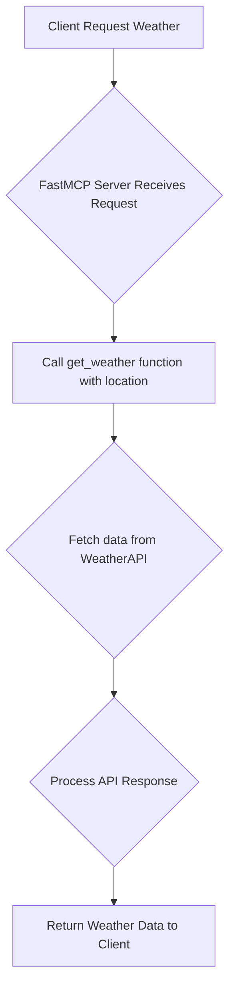

# Level 2 - Weather Server (FastMCP)

## 🌦️ Why I Built This

After getting the calculator working, I wanted to try something a bit more real-world—so I picked weather! This project is my way of learning (and sharing) how to connect an MCP server to an external API, handle async HTTP requests, and deal with real data (and real errors). If you're new to API integration, this is a great place to start.

---

## 🗂️ Project Structure

```text
level-2/
├── weather_server.py   # MCP Server exposing the weather tool
├── README.md           # Documentation
```

---

## 🚀 How to Run This (Step-by-Step)

1. **Install dependencies:**
   ```bash
   pip install python-dotenv httpx fastmcp
   ```
2. **Get a WeatherAPI key:**
   - Sign up at https://www.weatherapi.com/ and grab your free API key.
3. **Set up your .env file:**
   ```env
   WEATHER_API_KEY=YOUR_API_KEY
   ```
4. **Start the server:**
   ```bash
   python weather_server.py
   ```
5. **Test it!**
   - Send a request like:
     ```json
     { "tool": "get_weather", "args": { "location": "London" } }
     ```
   - You'll get back something like:
     ```json
     { "location": "London", "country": "UK", "temp_c": 18, "condition": "Partly cloudy" }
     ```

---

## 🔄 How It Works (Flowchart)

Here's a simple flowchart illustrating the process of getting weather information:



---

## 🛠️ What Tool Is Included?

### `get_weather(location: str) -> dict`
Fetches the current weather for a given city or region.

```python
@mcp.tool()
async def get_weather(location: str) -> dict:
    """Get current weather info for a given city or region.

    Args:
        location: City or place name (e.g. Delhi, London)
    """
    # ... (see weather_server.py for full implementation) ...
    pass
```

This tool takes a `location` (city or region name) as input and returns a dictionary containing the current weather information (location name, country, temperature in Celsius, and condition text). It handles API key validation and potential HTTP or other exceptions.

---

## 💡 What You'll Learn
- How to call external APIs from your MCP tool
- How to handle timeouts, retries, and errors gracefully
- How to return structured data to the user

## 🧑‍💻 Why This Matters
This step taught me how to make my tools actually useful—by connecting them to real-world data. Plus, I learned a lot about handling things when they go wrong (see the error flowchart above!).

---

## 🖼️ Visual Example: Using the Weather Tool


*This shows the use of the get_weather tool to fetch and display the current weather for Mumbai, including the request sent to the tool and the response received.*

---

## 🙌 Ready to Learn or Contribute?

If you’ve made it this far—thank you! I built this project to help others learn, experiment, and build real solutions. Whether you’re a total beginner or an experienced developer, your questions and contributions are always welcome.

**Next Steps:**
- Try running the weather tool and see what you can build.
- If you get stuck, open an issue or reach out—I'm happy to help!
- Want to add a new feature or fix a bug? Fork the repo and send a pull request.

Let’s make document processing easier, together! 
