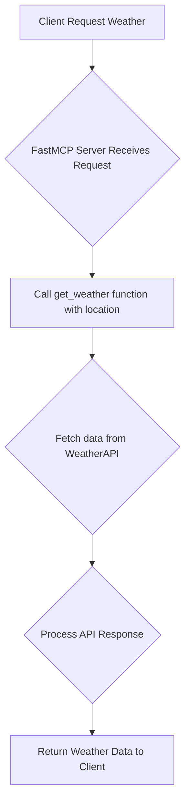

# Weather Server (FastMCP)

## Description

This project implements a simple weather server using the FastMCP framework and the WeatherAPI. It provides a tool to fetch current weather information for a given city or region.

## Setup

1.  **Prerequisites:** Ensure you have Python installed.
2.  **Clone the repository:**
    ```bash
    git clone <repository_url>
    cd mcp-server # Assuming the project is in a folder named mcp-server
    ```
3.  **Install dependencies:**
    ```bash
    pip install python-dotenv httpx fastmcp
    ```
4.  **Get a WeatherAPI key:** Obtain a free API key from [https://www.weatherapi.com/](https://www.weatherapi.com/).
5.  **Create a `.env` file:** In the root directory of the project, create a file named `.env` and add your API key:
    ```dotenv
    WEATHER_API_KEY=YOUR_API_KEY
    ```
    Replace `YOUR_API_KEY` with your actual WeatherAPI key.

## Usage

Run the server using the following command:

```bash
python weather_server.py
```

The server will start and be ready to accept requests via the FastMCP protocol (in this case, configured for stdio).

## Flowchart

Here's a simple flowchart illustrating the process of getting weather information:



## Code Documentation

### `get_weather(location: str) -> dict`

```python
@mcp.tool()
async def get_weather(location: str) -> dict:
    """Get current weather info for a given city or region.

    Args:
        location: City or place name (e.g. Delhi, London)
    """
    # ... (see weather_server.py for full implementation) ...
    pass
```

This asynchronous function is exposed as a FastMCP tool. It takes a `location` (city or region name) as input and returns a dictionary containing the current weather information (location name, country, temperature in Celsius, and condition text). It handles API key validation and potential HTTP or other exceptions.

## Detailed Feedback

[Add any specific feedback or notes about the project here. For example, potential improvements, known issues, or design considerations.]

[Provide feedback here...] 