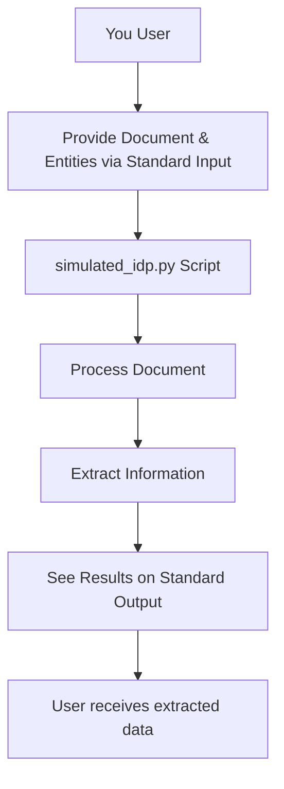

# Level 3 - MCP Entity Extraction System

## 🏁 Why I Built This

After connecting to real-world APIs, I wanted to see if I could extract useful information from documents themselves. This project is my hands-on journey into entity extraction: pulling out things like invoice numbers, dates, and totals from raw text. If you’re curious about how to automate document understanding, this is a great place to start!

---

## 🗂️ Project Structure

```
level-3/
├── simulated_idp.py  # FastMCP script for entity extraction
└── README.md         # This documentation
```

---

## 🚀 How to Run This (Step-by-Step)

1. **Start the server:**
   ```bash
   python simulated_idp.py
   ```
2. **Test it!**
   - When the script is running, provide input as JSON:
     ```json
     {"document": "Invoice No: INV-12345 Customer: John Doe Date: 2024-06-01 Total: $100.00", "entities": ["invoice_number", "customer", "date", "total"]}
     ```
   - You'll get back:
     ```json
     {
       "pages": [
         {
           "page": 1,
           "entities": {
             "invoice_number": "INV-12345",
             "customer": "John Doe",
             "date": "2024-06-01",
             "total": "$100.00"
           },
           "messages": []
         }
       ]
     }
     ```

---

## 🔄 How It Works (Flowchart)

Here's a simple flow chart showing how the system works:



---

## 🛠️ What Tool Is Included?

### `extract(document: str, entities: list[str]) -> dict`
Extracts specified entities from the provided document text.

- Input: `document` (string), `entities` (list of strings)
- Output: Dictionary with extracted values for each entity

---

## 💡 What You'll Learn
- How to process documents line by line
- How to extract key-value pairs using simple pattern matching
- Why input format and document structure matter

## 🧑‍💻 Why This Matters
This project taught me that real-world documents are messy! I ran into spacing and alignment issues, which led me to look for better solutions in the next level.

---

## 🖼️ Visual Example: Entity Extraction

### Input Example


*This shows the input invoice and the entity extraction request, specifying the entities to extract (Invoice No, Date, Status).* 

### Output Example


*This shows the extracted output for the requested entities: invoice number, date, and status.*

