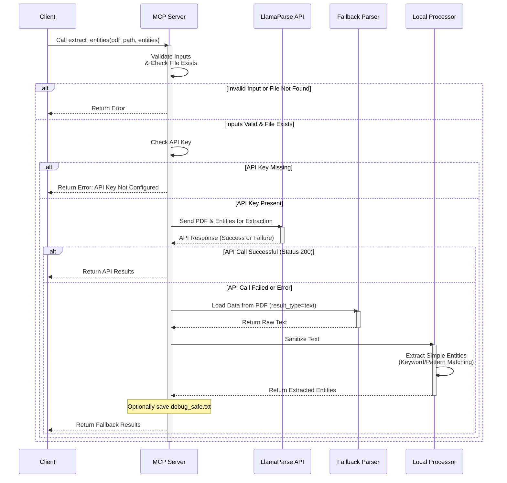

# LlamaParse MCP Project

This project implements a Micro Code Plugin (MCP) server using `fastmcp` that leverages the LlamaParse API and a fallback mechanism to extract entities from PDF documents.

## Features

- **PDF Entity Extraction:** Extracts specified entities from PDF files using the LlamaParse API.
- **Fallback Mechanism:** Includes a simple text-based extraction as a fallback if the API fails.
- **Encoding Safety:** Implements robust encoding handling to prevent issues with diverse text content.
- **Tooling:** Provides tools for entity extraction and connection testing.

## Setup

1.  **Clone the repository:**
    ```bash
    git clone <repository_url>
    cd <repository_directory>
    ```

2.  **Install dependencies:**
    ```bash
    pip install -r requirements.txt
    ```

3.  **Set up API Key:**
    Create a `.env` file in the project root with your Llama Cloud API key:
    ```env
    LLAMA_CLOUD_API_KEY=your_api_key_here
    ```

## Running the Server

Run the `server.py` file:

```bash
pip install -r requirements.txt
python server.py
```

The server will start and listen for connections via standard I/O.

## Tools

The project exposes the following tools via the `fastmcp` server:

### `extract_entities`

Extracts a list of specified entities from a PDF file.

-   **Input:**
    -   `pdf_path` (str): The path to the PDF file.
    -   `entities` (List[str]): A list of entity names (strings) to extract.

-   **Output:**
    -   A dictionary containing the extracted entities. If the API is successful, it returns the API response. If the fallback is used, it returns a dictionary with `status`, `method`, `entities_found`, `text_preview`, and `total_characters`.
    -   Returns an error dictionary if inputs are missing, the file is not found, the API key is not configured, or parsing fails.

### `test_connection`

Tests the server connection and checks for API key presence.

-   **Input:** None.
-   **Output:** A dictionary indicating the connection status, encoding method, API key presence, and a test message. Returns an error dictionary if the test fails.

## System Architecture and Process Flow

### High-Level Flow
```mermaid
graph TD
    A[Start Entity Extraction] --> B{PDF Path and Entities Provided?}
    B -- Yes --> C{PDF File Exists?}
    B -- No --> Z[Return Error: Missing Input]
    C -- Yes --> D{LLAMA_API_KEY Configured?}
    C -- No --> Y[Return Error: File Not Found]
    D -- No --> X[Return Error: API Key Not Configured]
    D -- Yes --> E[Attempt API Extraction]
    E --> F{API Call Successful (Status 200)?}
    E --> G[API Call Failed or Error]
    F -- Yes --> H[Return API Response]
    F -- No --> G
    G --> I[Use Fallback Parsing (LlamaParse)]
    I --> J{PDF Text Extracted?}
    J -- Yes --> K{Text Content Empty?}
    J -- No --> W[Return Error: No Text Extracted]
    K -- Yes --> V[Return Error: PDF Empty]
    K -- No --> L[Extract Simple Entities from Text]
    L --> M[Save Debug Safe Text (Optional)]
    L --> N[Return Fallback Results]
```

### Detailed Process Flow (extract_entities tool)


## Feedback on Project MCP (Micro Code Plugin)

The project demonstrates a clear understanding of the MCP concept by exposing specific functionalities as tools. The use of `fastmcp` simplifies the server implementation. The inclusion of a fallback mechanism for PDF parsing is a good practice for robustness.

**Areas for Improvement and Consideration:**

*   **Error Handling Granularity:** While basic error handling is present (e.g., missing inputs, file not found), providing more specific error types or codes could be beneficial for clients consuming the tools. This allows clients to handle different failure scenarios more effectively.
*   **Fallback Extraction Improvement:** The current fallback `extract_simple_entities` is a very basic text search. For more complex PDFs or entity patterns, this might not be sufficient. Consider integrating a more sophisticated local parsing library (if performance allows and licensing is compatible) or improving the regex/keyword matching in the fallback.
*   **API Key Management:** Storing the API key in a `.env` file is standard for development, but for production deployments, consider more secure methods like environment variables or a dedicated secret management system.
*   **Asynchronous Operations:** The `extract_entities` tool is defined as `async`, which is appropriate for I/O-bound operations like API calls and file reading. Ensure that any future additions or modifications maintain this asynchronous pattern where necessary to prevent blocking the server.
*   **Logging:** The use of `ascii_safe_print` is a workaround for encoding issues. Implementing a standard logging system (`logging` module) with appropriate handlers and formatters would provide more structured and configurable logging, especially for production environments. Ensure the logging system also handles encoding correctly.
*   **Dependencies:** Explicitly listing dependencies and their versions in `requirements.txt` is good. Consider using a dependency management tool like Poetry or Pipenv for better management and reproducible builds.
*   **Code Structure:** For larger projects, consider organizing the code into smaller modules or packages based on functionality (e.g., a `parsing` module, an `api` module) to improve maintainability and readability.
*   **Testing:** Adding unit tests for the utility functions (`ultra_sanitize_text`, `extract_simple_entities`) and integration tests for the tools (`extract_entities`, `test_connection`) would significantly improve code reliability and facilitate future refactoring.
*   **Documentation:** Add docstrings to functions and classes explaining their purpose, arguments, and return values. This improves code readability and helps in generating automated documentation. (Self-correction: I have included tool documentation in this README, but adding it within the code itself is also valuable).

Overall, the project provides a solid foundation for a PDF entity extraction MCP. Addressing the areas for improvement will make it more robust, maintainable, and production-ready. 