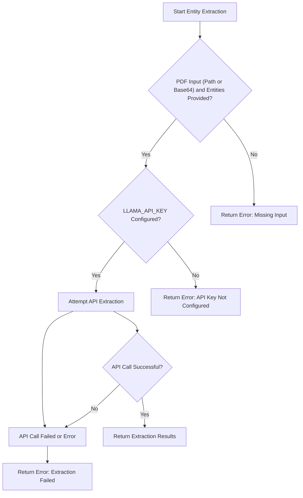
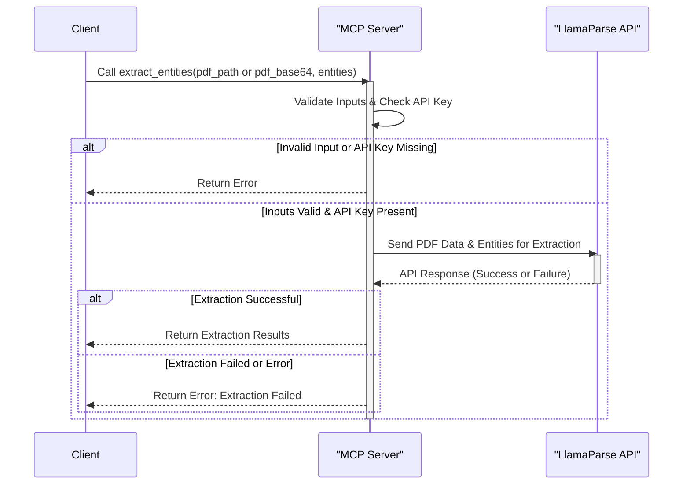

# LlamaParse MCP Project

This project implements a Micro Code Plugin (MCP) server using `fastmcp` that leverages the LlamaParse API to extract entities from PDF documents.

## Features

- **PDF Entity Extraction:** Extracts specified entities from PDF files using the LlamaParse API.
- **Encoding Safety:** Implements robust encoding handling to prevent issues with diverse text content.
- **Tooling:** Provides a tool for entity extraction.

## Setup

1.  **Clone the repository:**
    ```bash
    git clone <repository_url>
    cd <repository_directory>
    ```

2.  **Install dependencies:**
    ```bash
    pip install -r requirements.txt
    ```

3.  **Set up API Key:**
    Create a `.env` file in the project root with your Llama Cloud API key:
    ```env
    LLAMA_CLOUD_API_KEY=your_api_key_here
    ```

## Running the Server

Run the `server-sdk.py` file:

```bash
pip install -r requirements.txt
python server-sdk.py
```

The server will start and listen for connections via standard I/O.

## Tools

The project exposes the following tool via the `fastmcp` server:

### `extract_entities`

Extracts a list of specified entities from a PDF file or a base64 encoded PDF string using the LlamaParse API.

-   **Input:**
    -   `pdf_path` (Optional[str]): The path to the PDF file.
    -   `pdf_base64` (Optional[str]): The base64 encoded content of the PDF file.
    -   `entities` (List[str]): A list of entity names (strings) to extract.
    *Note: Provide either `pdf_path` or `pdf_base64`.*

-   **Output:**
    -   A dictionary containing the extracted entities, using fuzzy matching from the PDF text.
    -   Returns an error dictionary if inputs are missing, the file is not found (if `pdf_path` is used), or the API call fails.

## Usage Example

Here's an example of how to use the `extract_entities` tool:

```python
import requests
import json
import base64

# Replace with your actual server URL if different
SERVER_URL = "http://127.0.0.1:8000/tools/extract_entities"

# Example: Using a local PDF file
def extract_from_file(file_path, entities):
    with open(file_path, "rb") as f:
        pdf_data = f.read()
        pdf_base64 = base64.b64encode(pdf_data).decode("utf-8")

    headers = {"Content-Type": "application/json"}
    payload = {
        "pdf_base64": pdf_base64,
        "entities": entities
    }
    response = requests.post(SERVER_URL, headers=headers, data=json.dumps(payload))
    return response.json()

# Example usage:
# entities_to_extract = ["Name", "Address", "Invoice Number"]
# result = extract_from_file("path/to/your/document.pdf", entities_to_extract)
# print(json.dumps(result, indent=2))

# Example: Direct base64 string (for demonstration, usually from file)
def extract_from_base64(base64_string, entities):
    headers = {"Content-Type": "application/json"}
    payload = {
        "pdf_base64": base64_string,
        "entities": entities
    }
    response = requests.post(SERVER_URL, headers=headers, data=json.dumps(payload))
    return response.json()

# Example usage:
# dummy_base64 = "JVBERi0xLjQKBConX..."
# result_base64 = extract_from_base64(dummy_base64, ["Date", "Total"])
# print(json.dumps(result_base64, indent=2))
```

---

## 🖼️ Visual Example: Using Base64 PDF Input


* This shows the use of the extract_entities tool with a base64-encoded PDF (instead of a file path). This demonstrates that you can use either a PDF path or a base64 string as input for extraction.

## System Architecture and Process Flow

### High-Level Flow


### Detailed Process Flow (extract_entities tool)


## Feedback on Project MCP (Micro Code Plugin)

The project demonstrates a clear understanding of the MCP concept by exposing specific functionality as a tool. The use of `fastmcp` simplifies the server implementation.

**Areas for Improvement and Consideration:**

*   **Error Handling Granularity:** While basic error handling is present (e.g., missing inputs, file not found), providing more specific error types or codes could be beneficial for clients consuming the tool. This allows clients to handle different failure scenarios more effectively.
*   **API Key Management:** Storing the API key in a `.env` file is standard for development, but for production deployments, consider more secure methods like environment variables or a dedicated secret management system.
*   **Asynchronous Operations:** The `extract_entities` tool is defined as `async`, which is appropriate for I/O-bound operations like API calls and potentially file reading. Ensure that any future additions or modifications maintain this asynchronous pattern where necessary to prevent blocking the server.
*   **Logging:** Implementing a standard logging system (`logging` module) with appropriate handlers and formatters would provide more structured and configurable logging, especially for production environments.
*   **Dependencies:** Explicitly listing dependencies and their versions in `requirements.txt` is good. Consider using a dependency management tool like Poetry or Pipenv for better management and reproducible builds.
*   **Code Structure:** For larger projects, consider organizing the code into smaller modules or packages based on functionality (e.g., an `api` module) to improve maintainability and readability. *Note: Docstrings have been added to functions and classes, improving readability.*
*   **Testing:** Adding unit tests for utility functions and integration tests for the tool (`extract_entities`) would significantly improve code reliability and facilitate future refactoring.
*   **Documentation:** Docstrings have been added to functions and classes explaining their purpose, arguments, and return values, significantly improving code readability and aiding in automated documentation generation.

Overall, the project provides a solid foundation for a PDF entity extraction MCP. Addressing the areas for improvement will make it more robust, maintainable, and production-ready. 
