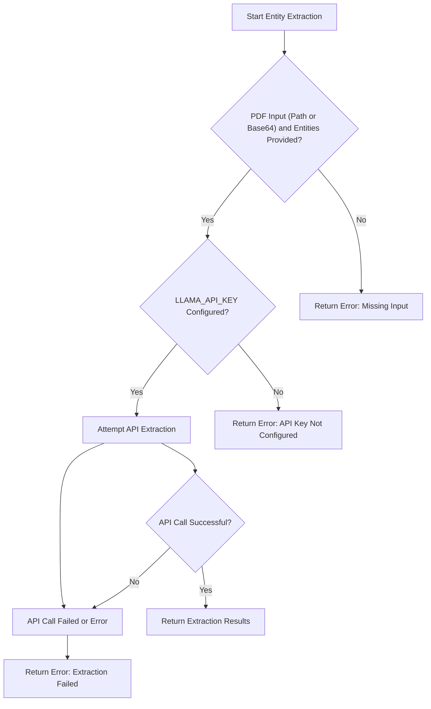

# Level 4 - LlamaIndex MCP Project

## 🦙 Why I Built This

After learning the basics of entity extraction, I wanted to make my tools smarter and more robust. This project is my step into using the LlamaIndex API for PDF entity extraction, with a focus on encoding safety and real-world reliability. If you want to see how to connect your MCP server to a powerful parsing API, you’re in the right place!

---

## 🗂️ Project Structure

```
level-4/
├── server-sdk.py       # MCP server using LlamaIndex API
├── requirements.txt    # Python dependencies
├── README.md           # Documentation
```

---

## 🚀 How to Run This (Step-by-Step)

1. **Set up your API key:**
   - Create a `.env` file in the project root with your [Llama Cloud API key](https://cloud.llamaindex.ai/project/6d759a43-6134-4e3e-844f-2f4a6cd400a6):
     ```env
     LLAMA_CLOUD_API_KEY=your_api_key_here
     ```
2. **Start the server:**
   ```bash
   python server-sdk.py
   ```
3. **Test it!**
   - Use a tool like `curl` or any HTTP client to send a request (see below for an example).

---

## 🔄 How It Works (Flowchart)

(See the flowcharts below for a high-level and detailed process overview. These diagrams show how the server validates input, calls the LlamaIndex API, and returns results or errors.)

---

## 🛠️ What Tool Is Included?

### `extract_entities`
Extracts a list of specified entities from a PDF file or a base64 encoded PDF string using the LlamaIndex API.

- **Input:**
  - `pdf_path` (Optional[str]): The path to the PDF file.
  - `pdf_base64` (Optional[str]): The base64 encoded content of the PDF file.
  - `entities` (List[str]): A list of entity names (strings) to extract.
  - *Note: Provide either `pdf_path` or `pdf_base64`.*
- **Output:**
  - A dictionary containing the extracted entities, using fuzzy matching from the PDF text.
  - Returns an error dictionary if inputs are missing, the file is not found, or the API call fails.

---

## 💡 What You'll Learn
- How to connect your MCP server to a cloud API
- How to handle both file path and base64 PDF input
- How to extract entities from real-world PDFs

## 🧑‍💻 Why This Matters
This project taught me how to build more reliable, production-ready tools. I learned the importance of error handling, encoding safety, and clear API design.

---

## System Architecture and Process Flow

### High-Level Flow


### Detailed Process Flow (extract_entities tool)
```mermaid
sequenceDiagram
    participant Client
    participant MCPServer as "MCP Server"
    participant LlamaIndexAPI as "LlamaIndex API"

    Client->>MCPServer: Call extract_entities(pdf_path or pdf_base64, entities)
    activate MCPServer
    MCPServer->>MCPServer: Validate Inputs & Check API Key
    alt Invalid Input or API Key Missing
        MCPServer-->>Client: Return Error
    else Inputs Valid & API Key Present
        MCPServer->>LlamaIndexAPI: Send PDF Data & Entities for Extraction
        activate LlamaParseAPI
        LlamaIndexAPI-->>MCPServer: API Response (Success or Failure)
        deactivate LlamaParseAPI
        alt Extraction Successful
            MCPServer-->>Client: Return Extraction Results
        else Extraction Failed or Error
            MCPServer-->>Client: Return Error: Extraction Failed
        end
    end
    deactivate MCPServer
```
---

## 🖼️ Visual Example: Using Base64 PDF Input


*This shows the use of the extract_entities tool with a base64-encoded PDF (instead of a file path). This demonstrates that you can use either a PDF path or a base64 string as input for extraction.*
