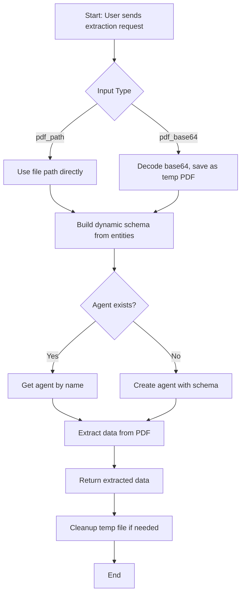

# Llamaparse-all

A dynamic PDF extraction server using LlamaParse, supporting runtime schema generation and flexible PDF input (file path or base64). Designed for integration with Claude or similar frontends.

---

## Features

- **Dynamic Schema Extraction:** Entities to extract are defined at runtime, not hardcoded.
- **Flexible PDF Input:** Accepts both file paths and base64-encoded PDFs.
- **Agent Management:** Reuses or creates LlamaParse agents as needed.
- **Robust Error Handling:** Handles invalid input, agent creation issues, and file cleanup.

---

## Requirements

```
llama-cloud-services
python-dotenv
fastapi
uvicorn
mcp
```

---

## How It Works

### Main Extraction Flow



---

## Code Snippets

### 1. Python: Call Extraction Tool

```python
import requests

url = "http://localhost:8000/tools/create_agent_and_extract"
payload = {
    "entities": ["InvoiceNumber", "TotalAmount", "Date"],
    "agent_name": "invoice_extractor",
    "pdf_path": "/path/to/invoice.pdf"  # or use 'pdf_base64' for base64 input
}
response = requests.post(url, json=payload)
print(response.json())
```

### 2. Python: Provide Entities and PDF Input

```python
entities = ["Name", "Address", "Amount"]
agent_name = "custom_agent"
pdf_path = "/path/to/document.pdf"
# Optionally, for base64:
# with open(pdf_path, "rb") as f:
#     pdf_base64 = base64.b64encode(f.read()).decode()
```

### 3. curl: Call Extraction Tool

```bash
curl -X POST http://localhost:8000/tools/create_agent_and_extract \
  -H "Content-Type: application/json" \
  -d '{
    "entities": ["Name", "Amount"],
    "agent_name": "my_agent",
    "pdf_path": "/path/to/file.pdf"
  }'
```

---

## Main Server Code Example

```python
from llama_cloud_services import LlamaExtract
from pydantic import BaseModel, Field, create_model
from typing import List, Optional
import os
import base64
from dotenv import load_dotenv
from mcp.server.fastmcp import FastMCP
import tempfile

load_dotenv()

LLAMA_API_KEY = os.getenv("LLAMA_CLOUD_API_KEY")
extractor = LlamaExtract()
mcp = FastMCP("llamaparse_dynamic_extract_level_5")

# Helper
def save_pdf(pdf_path: Optional[str], pdf_base64: Optional[str]) -> Optional[str]:
    if pdf_path and os.path.exists(pdf_path):
        return pdf_path
    if pdf_base64:
        with tempfile.NamedTemporaryFile(delete=False, suffix=".pdf") as f:
            f.write(base64.b64decode(pdf_base64))
            return f.name
    return None

# === Factory Class ===
class DynamicSchemaFactory:
    @staticmethod
    def build_schema(entities: List[str]) -> type[BaseModel]:
        fields = {
            entity: (str, Field(description=f"{entity} extracted from the document"))
            for entity in entities
        }
        return create_model("DynamicExtractionSchema", **fields)

@mcp.tool()
async def create_agent_and_extract(
    entities: List[str],
    agent_name: str,
    pdf_path: Optional[str] = None,
    pdf_base64: Optional[str] = None
) -> dict:
    path = save_pdf(pdf_path, pdf_base64)
    if not path:
        return {"error": "Provide valid pdf_path or pdf_base64"}

    try:
        schema = DynamicSchemaFactory.build_schema(entities)

        try:
            agent = extractor.get_agent(name=agent_name)
        except:
            agent = extractor.create_agent(name=agent_name, data_schema=schema)

        result = agent.extract(path)
        return {"agent": agent_name, "data": result.data}
    except Exception as e:
        return {"error": str(e)}
    finally:
        if pdf_base64 and os.path.exists(path):
            os.remove(path)

@mcp.tool()
async def get_extraction_result(
    agent_name: str,
    pdf_path: Optional[str] = None,
    pdf_base64: Optional[str] = None
) -> dict:
    path = save_pdf(pdf_path, pdf_base64)
    if not path:
        return {"error": "Provide valid pdf_path or pdf_base64"}
    try:
        agent = extractor.get_agent(name=agent_name)
        result = agent.extract(path)
        return {"data": result.data}
    except Exception as e:
        return {"error": str(e)}
    finally:
        if pdf_base64 and os.path.exists(path):
            os.remove(path)

if __name__ == "__main__":
    mcp.run(transport="streamable-http")
```

---

## 🐞 Problems Faced & How We Solved Them

### 1. Dynamic Schema Handling

**Problem:**  
LlamaParse expects a predefined schema, but our entities vary per document/user input.

**Solution:**  
Used a Factory Design Pattern with Pydantic's `create_model()` to generate schemas dynamically at runtime.

---

### 2. Input Format Limitation (Base64 vs PDF Path)

**Problem:**  
Initially only supported base64, but Claude sends file paths.

**Solution:**  
Updated the tool to accept either `pdf_path` or `pdf_base64`, decoding and saving as needed.

---

### 3. Agent Creation Timeout

**Problem:**  
Dynamic agent creation sometimes timed out or failed silently.

**Solution:**  
Added robust error handling, consistent agent naming, and ensured file cleanup logic doesn't block extraction.

---

### 4. Tool 2 Debugging Confusion

**Problem:**  
A secondary debugging tool cluttered the server.

**Solution:**  
Removed the second tool and integrated debugging/logging into the main extraction tool.

---

## Project Structure

```
.
├── server.py          # Main server and extraction logic
├── requirements.txt   # Python dependencies
```

---

## Usage

1. Set your `LLAMA_CLOUD_API_KEY` in a `.env` file.
2. Install dependencies:  
   `pip install -r requirements.txt`
3. Run the server:  
   `python server.py`
4. Use the exposed MCP tools for dynamic PDF extraction. 

---

## 🖼️ Visual Walkthrough: PDF Extraction Process


### 1. Reading File


* Example output: Extracted service items and their details from the PDF.

### 2. Checking allowed directories


* This shows the allowed directories for file access: Desktop and Downloads. Make sure your files are in these folders to avoid access errors.

### 3. Searching for PDF Files


* You can search for your PDF files in the allowed directories to ensure they are accessible for processing.

### 4. Calling the Extraction Tool


* Example of a request to the extraction tool, specifying entities, the PDF path, and the agent name.

### 5. Output


* Output in the extraction process.  
