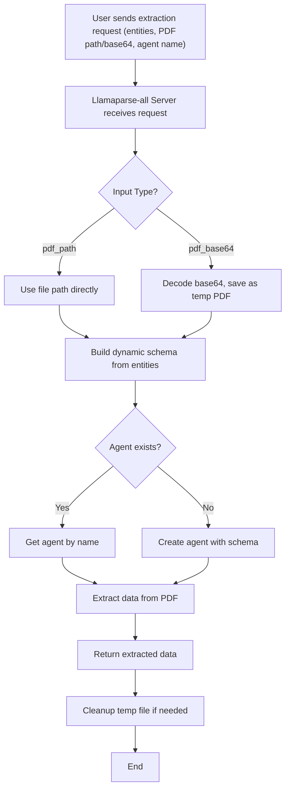

# Level-5 - Dynamic PDF Extraction Server

## 🚀 Why I Built This

After building the previous levels, I wanted a truly flexible, production-ready solution. Llamaparse-all is my answer: a dynamic PDF extraction server that lets you define what you want to extract at runtime. No more hardcoding schemas—just tell it what you need! If you want to build your own document extraction service, start here.

---

## 🗂️ Project Structure

```
Llamaparse-all/
├── server.py          # Main server and extraction logic
├── requirements.txt   # Python dependencies
├── README.md          # Documentation
```

---

## 🚀 How to Run This (Step-by-Step)

1. **Set your API key:**
   - Add your `LLAMA_CLOUD_API_KEY` to a `.env` file.
2. **Install requirements:**
   ```bash
   pip install -r Llamaparse-all/requirements.txt
   ```
3. **Start the server:**
   ```bash
   python Llamaparse-all/server.py
   ```
4. **Test it!**
   - Send a request like:
     ```json
     {
       "entities": ["InvoiceNumber", "TotalAmount", "Date"],
       "agent_name": "invoice_extractor",
       "pdf_path": "/path/to/invoice.pdf"
     }
     ```
   - You'll get back:
     ```json
     { "agent": "invoice_extractor", "data": { "InvoiceNumber": "INV-12345", "TotalAmount": "$100.00", "Date": "2024-06-01" } }
     ```

---

## 🔄 Main Extraction Workflow (Flowchart)

Here's a visual overview of how the Llamaparse-all server processes a request, from user input to result:



---

## 🛠️ What Tools Are Included?

- **create_agent_and_extract**: Dynamically creates (or reuses) an agent and extracts the specified entities from a PDF (by file path or base64).
- **get_extraction_result**: Gets extraction results from an existing agent for a given PDF.

---

## 💡 What You'll Learn
- How to build a dynamic, schema-free extraction server
- How to handle both file path and base64 PDF input
- How to manage agents and clean up resources automatically

## 🧑‍💻 Why This Matters
This module is the culmination of everything I learned—it's robust, flexible, and ready for real-world use. If you want to build your own document extraction service, start here!

---

## 🙌 Ready to Learn or Contribute?

If you’ve made it this far—thank you! I built this project to help others learn, experiment, and build real solutions. Whether you’re a total beginner or an experienced developer, your questions and contributions are always welcome.

**Next Steps:**
- Try running the server and see what you can build.
- If you get stuck, open an issue or reach out—I'm happy to help!
- Want to add a new feature or fix a bug? Fork the repo and send a pull request.

Let’s make document processing easier, together!  