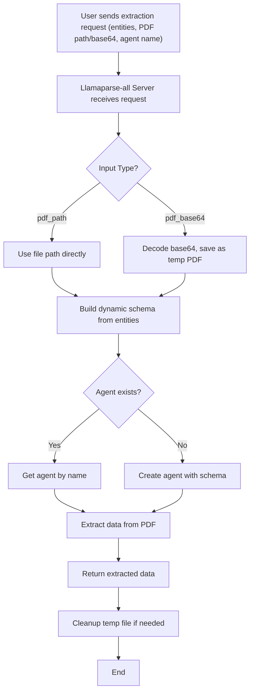
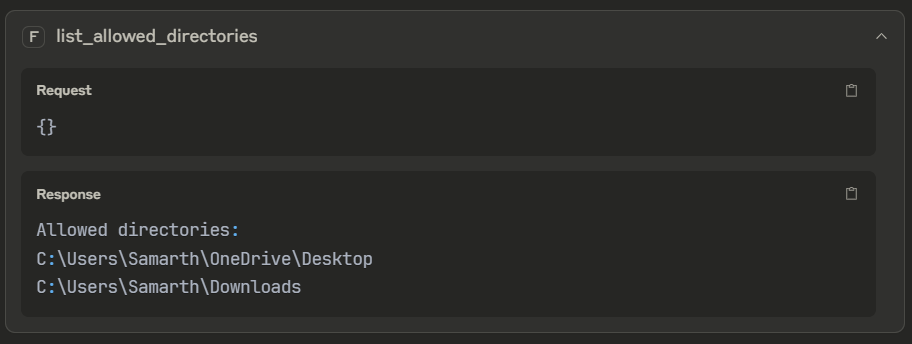

# Level-5 - Dynamic PDF Extraction Server

## 🚀 Why I Built This

After building the previous levels, I wanted a truly flexible, production-ready solution. Llamaparse-all is my answer: a dynamic PDF extraction server that lets you define what you want to extract at runtime. No more hardcoding schemas—just tell it what you need! If you want to build your own document extraction service, start here.

---

## 🗂️ Project Structure

```
Level-5/
├── server.py          # Main server and extraction logic
├── requirements.txt   # Python dependencies
├── README.md          # Documentation
```

---

## 🚀 How to Run This (Step-by-Step)

1. **Set your API key:**
   - Add your [`LLAMA_CLOUD_API_KEY`](https://cloud.llamaindex.ai/project/6d759a43-6134-4e3e-844f-2f4a6cd400a6) to a `.env` file.
2. **Start the server:**
   ```bash
   python Llamaparse-all/server.py
   ```
3. **Test it!**
   - Send a request like:
     ```json
     {
       "entities": ["InvoiceNumber", "TotalAmount", "Date"],
       "agent_name": "invoice_extractor",
       "pdf_path": "/path/to/invoice.pdf"
     }
     ```
   - You'll get back:
     ```json
     { "agent": "invoice_extractor", "data": { "InvoiceNumber": "INV-12345", "TotalAmount": "$100.00", "Date": "2024-06-01" } }
     ```

---

## 🔄 Main Extraction Workflow (Flowchart)

Here's a visual overview of how the Llamaparse-all server processes a request, from user input to result:



---

## Errors We Faced (and Fixed)

### 🔸 `ImportError` from `llama_cloud_services`

* **Problem:** Trying to import `SourceText`, which isn’t part of the SDK anymore (we’re using v0.6.41).
* **Fix:** Removed `SourceText` usage and simplified file input to use direct paths or base64 decoding.


### 🔸 Agent creation failed silently

* **Problem:** Sometimes agents weren’t getting created at all.
* **Cause:** Invalid or malformed dynamic schema or missing error handling around `create_agent()`.
* **Fix:** Added better exception handling and schema validation before calling the LlamaExtract SDK.


### 🔸 MCP Timeout (`error -32001`)

* **Problem:** The MCP server timed out waiting for LlamaExtract agent creation or extraction.
* **Fixes:**
  * Reduced unnecessary operations in the extract function
  * Moved to use `pdf_path` (Claude can’t send base64 easily)
  * Ensured we only create agents if they don’t already exist
  * Avoided extra MCP tool functions that could slow things down


### 🔸 Claude couldn’t send files

* **Problem:** Claude doesn’t send PDFs as base64, but our first version only accepted `pdf_base64`.
* **Fix:** Updated the server to accept both `pdf_path` and `pdf_base64` (with file existence check), so Claude works seamlessly.

---

## 🛠️ What Tools Are Included?

- **create_agent_and_extract**: Dynamically creates (or reuses) an agent and extracts the specified entities from a PDF (by file path or base64).
- **get_extraction_result**: Gets extraction results from an existing agent for a given PDF.

---

## 💡 What You'll Learn
- How to build a dynamic, schema-free extraction server
- How to handle both file path and base64 PDF input
- How to manage agents and clean up resources automatically

## 🧑‍💻 Why This Matters
This module is the culmination of everything I learned—it's robust, flexible, and ready for real-world use. If you want to build your own document extraction service, start here!

---
  
## 🖼️ Visual Example:

Below are visual examples illustrating the main steps and processes in the dynamic PDF extraction workflow:

**1. Allowed Directories Listing**


 
 *This displays the allowed directories on the system, indicating where files can be accessed for extraction.*

**2. PDF File Search**


 
 *This demonstrates searching for PDF files (such as test cases) within the allowed directories, a key step before extraction.*

**3. Extraction Agent Creation and Entity Extraction**


 
 *This shows the process of creating an extraction agent and extracting specific entities from a selected PDF file.*

**4. Extraction Agent Creation Output**


 
 *The output of the extraction agent and extracting specific entities from a selected PDF file.*  
