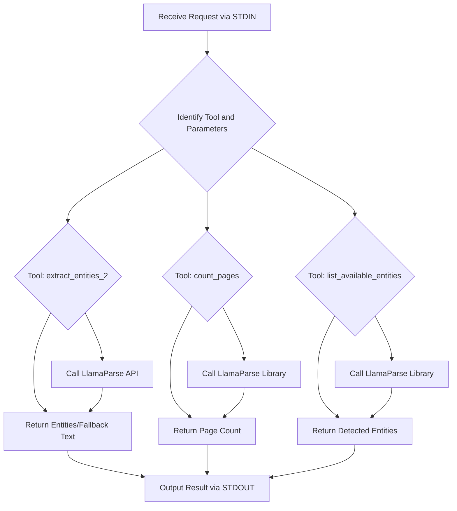

# MCP LlamaParse Server

This project implements a server using the FastMCP framework to process PDF files using the LlamaParse API. It provides tools for extracting entities, counting pages, and listing potential entities within a PDF document.

## Setup

1.  **Clone the repository:**

    ```bash
    git clone <repository_url>
    cd <repository_directory>
    ```

2.  **Install dependencies:**

    ```bash
    pip install -r requirements.txt
    ```

    *(Note: You may need to create a `requirements.txt` file with the necessary dependencies: `fastmcp`, `llama-parse`, `python-dotenv`, `requests`)*

3.  **Set up API Key:**

    Obtain a LlamaParse API key from [https://www.llamaparse.com/](https://www.llamaparse.com/) and add it to a `.env` file in the project root:

    ```dotenv
    LLAMA_CLOUD_API_KEY=your_api_key_here
    ```

4.  **Run the server:**

    ```bash
    python server.py
    ```

    The server will start and listen for requests via standard I/O.

## Process Flow

The server operates by receiving requests through standard input, identifying the requested tool and its parameters, and then executing the corresponding function in `server.py`. The main flow is as follows:

1.  The FastMCP server receives a request (e.g., to extract entities).
2.  The server routes the request to the appropriate tool function (`extract_entities_2`, `count_pages`, or `list_available_entities`).
3.  The tool function processes the request, typically involving interacting with the LlamaParse API.
4.  The tool returns a result (or an error) back to the server.
5.  The server outputs the result through standard output.

## Code Overview (`server.py`)

The `server.py` file contains the implementation of the MCP tools.

```python
from mcp.server.fastmcp import FastMCP
from llama_parse import LlamaParse
from dotenv import load_dotenv
import os
import base64
import requests
from typing import List, Dict, Any

# Load API key from .env
load_dotenv()
LLAMA_API_KEY = os.getenv("LLAMA_CLOUD_API_KEY")
LLAMA_API_URL = "https://api.llamaparse.com/v1/extract"

# Initialize FastMCP server
mcp = FastMCP("llamaparse-idp-final")

# ✅ Tool 1: Extract entities with per-page output
@mcp.tool()
async def extract_entities_2(pdf_path: str, entities: List[str]) -> dict:
    # Checks if the PDF file exists.
    if not os.path.exists(pdf_path):
        return {"error": f"File not found: {pdf_path}"}

    # Checks if the API key is configured.
    if not LLAMA_API_KEY:
        return {"error": "LlamaParse API key not configured"}

    try:
        # Opens and encodes the PDF for API request.
        with open(pdf_path, "rb") as f:
            encoded = base64.b64encode(f.read()).decode("utf-8")

        # Prepares the payload for the LlamaParse API.
        payload = {
            "document": {
                "content": encoded,
                "name": os.path.basename(pdf_path)
            },
            "entities": entities
        }

        # Sets up headers with authorization and content type.
        headers = {
            "Authorization": f"Bearer {LLAMA_API_KEY}",
            "Content-Type": "application/json"
        }

        # Sends the request to the LlamaParse API.
        response = requests.post(LLAMA_API_URL, headers=headers, json=payload, timeout=30)
        response.raise_for_status()
        result = response.json()

        # Formats the API response to include a 'pages' structure.
        if "pages" in result:
            return result
        else:
            return {
                "pages": [
                    {
                        "page": 1,
                        "entities": result.get("entities", {})
                    }
                ]
            }

    except Exception as api_error:
        # Implements a fallback mechanism using the llama_parse library directly.
        try:
            parser = LlamaParse(api_key=LLAMA_API_KEY, result_type="text", verbose=False)
            documents = parser.load_data(pdf_path)

            if not documents or not hasattr(documents[0], "text"):
                return {"error": "Fallback parsing failed: no text extracted."}

            # Returns full document text if fallback is used.
            return {
                "note": "Fallback: full document text returned.",
                "pages": [
                    {
                        "page": i + 1,
                        "text": doc.text
                    } for i, doc in enumerate(documents)
                ]
            }
        except Exception as fallback_error:
            # Handles errors from both API and fallback methods.
            return {
                "error": "Both API and fallback extraction failed.",
                "api_error": str(api_error),
                "fallback_error": str(fallback_error)
            }

# ✅ Tool 2: Count number of pages in PDF
@mcp.tool()
async def count_pages(pdf_path: str) -> dict:
    try:
        # Initializes LlamaParse and loads the document to count pages.
        parser = LlamaParse(api_key=LLAMA_API_KEY, result_type="text", verbose=False)
        documents = parser.load_data(pdf_path)
        return {"total_pages": len(documents)}
    except Exception as e:
        # Handles errors during page counting.
        return {"error": f"Failed to count pages: {str(e)}"}

# ✅ Tool 3: Detect available entities from PDF text
@mcp.tool()
async def list_available_entities(pdf_path: str) -> dict:
    try:
        # Initializes LlamaParse and loads the document to detect entities.
        parser = LlamaParse(api_key=LLAMA_API_KEY, result_type="text", verbose=False)
        documents = parser.load_data(pdf_path)
        if not documents:
            return {"error": "No pages found in document."}

        candidates = set()
        # Iterates through document text to find potential entities based on colon separation.
        for doc in documents:
            lines = doc.text.split("\n")
            for line in lines:
                if ':' in line:
                    key = line.split(':')[0].strip()
                    # Considers keys with up to 4 words as candidates.
                    if key and len(key.split()) <= 4:
                        candidates.add(key)

        return {"detected_entity_names": sorted(candidates)}

    except Exception as e:
        # Handles errors during entity detection.
        return {"error": f"Failed to extract entity names: {str(e)}"}

# Run the MCP server
if __name__ == "__main__":
    mcp.run(transport="stdio")

## Flowchart

Below is a flowchart illustrating the server's process flow, rendered using Mermaid syntax. View this README on a platform that supports Mermaid (like GitHub) to see the diagram.



## Usage

Once the server is running, you can interact with it by sending JSON requests to its standard input, specifying the tool and parameters. The server will respond with a JSON output to standard output.

Example request (conceptual):

```json
{
  "tool": "extract_entities_2",
  "parameters": {
    "pdf_path": "path/to/your/document.pdf",
    "entities": ["invoice number", "total amount"]
  }
}
```

Example response (conceptual):

```json
{
  "pages": [
    {
      "page": 1,
      "entities": {
        "invoice number": "INV-123",
        "total amount": "$100.00"
      }
    }
  ]
}
``` 