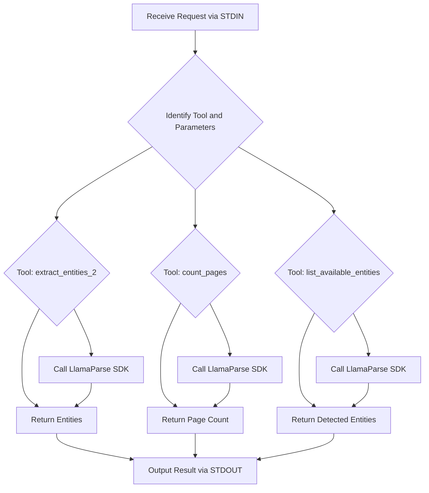

# MCP LlamaParse Server

This project implements a server using the FastMCP framework to process PDF files using the LlamaParse SDK, with optional Gemini-powered markdown normalization. It provides tools for extracting entities, counting pages, and listing potential entities within a PDF document.

## Setup

1.  **Clone the repository:**

    ```bash
    git clone <repository_url>
    cd <repository_directory>
    ```

2.  **Install dependencies:**

    ```bash
    pip install -r requirements.txt
    ```

3.  **Set up API Keys:**

    Obtain a LlamaParse API key from [https://www.llamaparse.com/](https://www.llamaparse.com/) and (optionally) a Gemini API key from Google AI Studio. Add them to a `.env` file in the project root:

    ```dotenv
    LLAMA_CLOUD_API_KEY=your_llamaparse_api_key_here
    GEMINI_API_KEY=your_gemini_api_key_here  # Optional, for markdown normalization
    ```

4.  **Run the server:**

    ```bash
    python server.py
    ```

    The server will start and listen for requests via streamable HTTP.

## Tools Overview (`server.py`)

- **extract_entities_2**: Extracts specified entities from a PDF (by file path or base64). Optionally normalizes markdown using Gemini if configured.
- **count_pages**: Returns the total number of pages in the PDF.
- **list_available_entities**: Lists candidate entity names detected in the PDF.

All tools accept either a `pdf_path` or a `pdf_base64` string as input.

## Error Handling

- Returns clear error messages for missing files, missing API keys, or SDK failures.
- Uses try/except blocks to catch and report errors.
- Feedback and error details are included in the response.

## Usage Example

Example request (using pdf_base64):

```json
{
  "tool": "extract_entities_2",
  "parameters": {
    "pdf_base64": "your_base64_encoded_pdf_string_here",
    "entities": ["invoice number", "total amount"]
  }
}
```

Example request (using pdf_path):

```json
{
  "tool": "count_pages",
  "parameters": {
    "pdf_path": "./sample.pdf"
  }
}
```

## Environment Variables

- `LLAMA_CLOUD_API_KEY` (required): Your LlamaParse API key.
- `GEMINI_API_KEY` (optional): Your Gemini API key for markdown normalization.

## Requirements

See `requirements.txt` for the full list of dependencies.

## Feedback & Improvements

See `FEEDBACK.md` for notes on error handling, tool design, and future improvements.

## Process Flow

The server operates by receiving requests through standard input, identifying the requested tool and its parameters, and then executing the corresponding function in `server.py`. The main flow is as follows:

1.  The FastMCP server receives a request (e.g., to extract entities).
2.  The server routes the request to the appropriate tool function (`extract_entities_2`, `count_pages`, or `list_available_entities`).
3.  The tool function processes the request using the LlamaParse SDK.
4.  The tool returns a result (or an error) back to the server.
5.  The server outputs the result through standard output.

## Code Overview (`server.py`)

The `server.py` file contains the implementation of the MCP tools using the LlamaParse SDK only.

```python
from mcp.server.fastmcp import FastMCP
from llama_parse import LlamaParse
from dotenv import load_dotenv
import os
import base64
from typing import List, Optional
import tempfile
import google.generativeai as genai
import traceback

# Load API keys from .env
load_dotenv()
LLAMA_API_KEY = os.getenv("LLAMA_CLOUD_API_KEY")
GEMINI_API_KEY = os.getenv("GEMINI_API_KEY")

# Configure Gemini
if GEMINI_API_KEY:
    genai.configure(api_key=GEMINI_API_KEY)

mcp = FastMCP("llamaparse-idp-markdown")

def get_pdf_path(pdf_path: Optional[str], pdf_base64: Optional[str]) -> Optional[str]:
    if pdf_path and os.path.exists(pdf_path):
        return pdf_path
    elif pdf_base64:
        with tempfile.NamedTemporaryFile(delete=False, suffix=".pdf") as tmp:
            tmp.write(base64.b64decode(pdf_base64))
            return tmp.name
    return None

@mcp.tool()
async def extract_entities_2(entities: List[str], pdf_path: Optional[str] = None, pdf_base64: Optional[str] = None) -> dict:
    path = get_pdf_path(pdf_path, pdf_base64)
    if not path:
        return {"error": "❌ Provide a valid 'pdf_path' or 'pdf_base64'"}
    try:
        parser = LlamaParse(api_key=LLAMA_API_KEY, result_type="markdown", verbose=False)
        documents = parser.load_data(path)

        results = []
        for i, doc in enumerate(documents):
            page_entities = {}
            text = doc.text if hasattr(doc, "text") else ""

            # Use Gemini to normalize markdown output if configured
            if GEMINI_API_KEY:
                try:
                    model = genai.GenerativeModel("models/gemini-pro")
                    prompt = f"Clean and normalize this markdown:\n{text if text is not None else ''}"
                    response = model.generate_content(prompt)
                    text = response.text
                except Exception as gemini_error:
                    print(f"Gemini normalization failed: {gemini_error}")

            for entity in entities:
                found = False
                for line in text.splitlines():
                    if entity.lower() in line.lower():
                        clean_line = line.replace("**", "").strip()
                        parts = clean_line.split(":", 1)
                        if len(parts) == 2 and entity.lower() in parts[0].lower():
                            page_entities[entity] = parts[1].strip()
                            found = True
                            break
                        parts = clean_line.split("-", 1)
                        if len(parts) == 2 and entity.lower() in parts[0].lower():
                            page_entities[entity] = parts[1].strip()
                            found = True
                            break
                if not found:
                    page_entities[entity] = None
            results.append({"page": i + 1, "entities": page_entities})

        return {"pages": results}
    except Exception as e:
        return {"error": f"SDK parsing failed: {str(e)}\n{traceback.format_exc()}"}

@mcp.tool()
async def count_pages(pdf_path: Optional[str] = None, pdf_base64: Optional[str] = None) -> dict:
    path = get_pdf_path(pdf_path, pdf_base64)
    if not path:
        return {"error": "Provide a valid 'pdf_path' or 'pdf_base64'"}
    try:
        parser = LlamaParse(api_key=LLAMA_API_KEY, result_type="markdown", verbose=False)
        documents = parser.load_data(path)
        return {"total_pages": len(documents)}
    except Exception as e:
        return {"error": f"Failed to count pages: {str(e)}"}

@mcp.tool()
async def list_available_entities(pdf_path: Optional[str] = None, pdf_base64: Optional[str] = None) -> dict:
    path = get_pdf_path(pdf_path, pdf_base64)
    if not path:
        return {"error": "Provide a valid 'pdf_path' or 'pdf_base64'"}
    try:
        parser = LlamaParse(api_key=LLAMA_API_KEY, result_type="markdown", verbose=False)
        documents = parser.load_data(path)
        candidates = set()
        for doc in documents:
            text = doc.text if hasattr(doc, "text") else ""
            for line in text.splitlines():
                clean_line = line.replace("**", "").strip()
                if ':' in clean_line:
                    key = clean_line.split(':')[0].strip()
                    if key and len(key.split()) <= 4:
                        candidates.add(key)
        return {"detected_entity_names": sorted(candidates)}
    except Exception as e:
        return {"error": f"Failed to extract entity names: {str(e)}"}

if __name__ == "__main__":
    mcp.run(transport="streamable-http")

```

## Flowchart

Below is a flowchart illustrating the server's process flow, rendered using Mermaid syntax. View this README on a platform that supports Mermaid (like GitHub) to see the diagram.



## Usage

Once the server is running, you can interact with it by sending JSON requests to its standard input, specifying the tool and parameters. The tools accept either a file path (`pdf_path`) or a base64 encoded string (`pdf_base64`) of the PDF content. The server will respond with a JSON output to standard output.

Example request (using pdf_base64):

```json
{
  "tool": "extract_entities_2",
  "parameters": {
    "pdf_base64": "your_base64_encoded_pdf_string_here",
    "entities": ["invoice number", "total amount"]
  }
}
```

Example request (using pdf_path):

```json
{
  "tool": "extract_entities_2",
  "parameters": {
    "pdf_path": "path/to/your/document.pdf",
    "entities": ["invoice number", "total amount"]
  }
}
```

Example response:

```json
{
  "pages": [
    {
      "page": 1,
      "entities": {
        "invoice number": "INV-123",
        "total amount": "$100.00"
      }
    }
  ]
}
```

---

## 🖼️ Visual Walkthrough: Entity Extraction Process

### 1. Reading the PDF File


* This shows the process of reading a PDF file for extraction.

### 2. Listing Allowed Directories


* This displays the allowed directories (Desktop and Downloads) where your PDF files must be located for access.

### 3. Calling the Extract Entities Tool


* This demonstrates how to call the extract_entities_2 tool, specifying the PDF path and the entities to extract.

### 4. Output Example


* This shows the output of the extraction process, including the extracted entities and their values.
