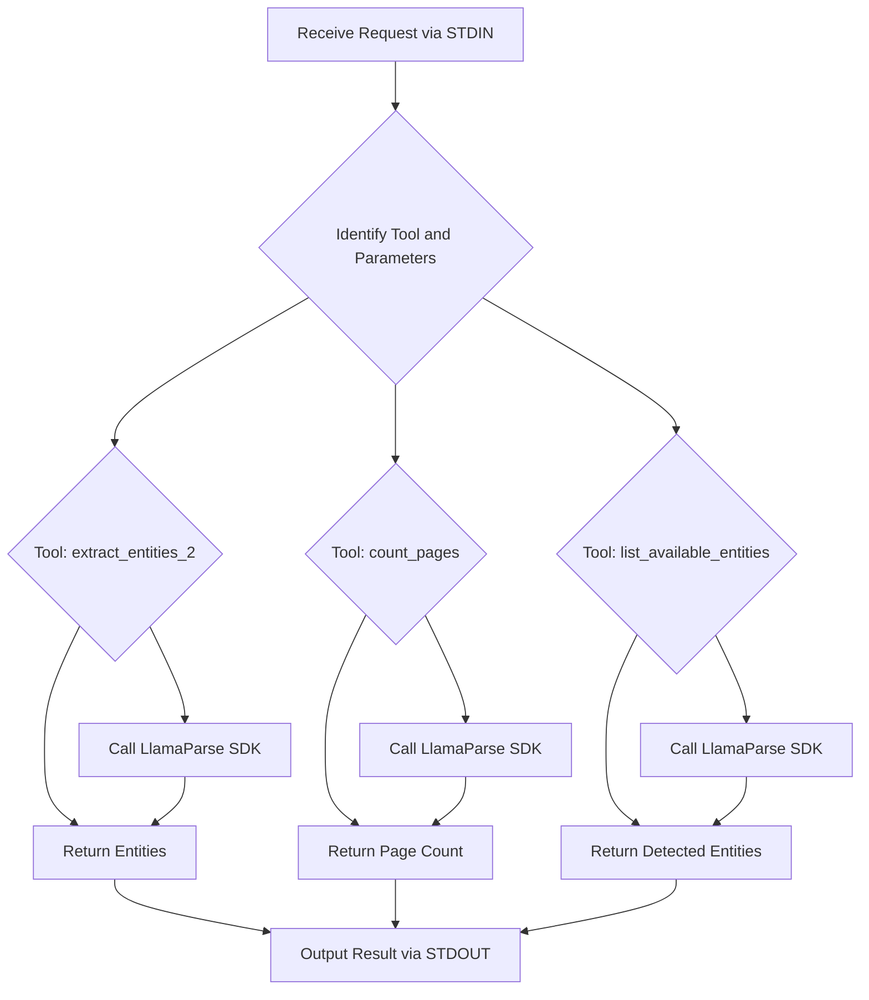

# Second-method - MCP LlamaParse Server

## 🏆 Why I Built This

After experimenting with text and basic entity extraction, I wanted a solution that was both robust and production-ready. This project is my deep dive into using the LlamaParse SDK for advanced PDF processing, with support for markdown output, streaming, and even Gemini-powered normalization. If you want to see how to build a real-world, high-performance document extraction server, this is it!

---

## 🗂️ Project Structure

```
second-method/
├── server.py           # MCP server using LlamaParse SDK
├── requirements.txt    # Python dependencies
├── README.md           # Documentation
```

---

## 🚀 How to Run This (Step-by-Step)

1. **Set up your API keys:**
   - Add your [`LLAMA_CLOUD_API_KEY`](https://cloud.llamaindex.ai/project/6d759a43-6134-4e3e-844f-2f4a6cd400a6) (and optionally Gemini API key) to a `.env` file:
     ```env
     LLAMA_CLOUD_API_KEY=your_llamaparse_api_key_here
     GEMINI_API_KEY=your_gemini_api_key_here  # Optional, for markdown normalization
     ```
2. **Start the server:**
   ```bash
   python server.py
   ```
3. **Test it!**
   - Send a request like:
     ```json
     {
       "tool": "extract_entities_2",
       "parameters": {
         "pdf_path": "path/to/your/document.pdf",
         "entities": ["invoice number", "total amount"]
       }
     }
     ```
   - You'll get back:
     ```json
     {
       "pages": [
         {
           "page": 1,
           "entities": {
             "invoice number": "INV-123",
             "total amount": "$100.00"
           }
         }
       ]
     }
     ```

---

## 🗺️ Detailed Server Process Flow (Flowchart)

Below is a flowchart illustrating the server's process flow, rendered using Mermaid syntax. View this README on a platform that supports Mermaid (like GitHub) to see the diagram.



---

## ✅ Errors Faced & Fixes in Level 5

Here are a few real-world issues we hit (and how we solved them) while building the Level 5 Second-method server:


🔴 **Claude Error:** ClaudeAiToolResultRequest.content.0.text.text: Input should be a valid string
- **Cause:** Claude was getting an invalid or malformed input string from the LlamaParse output.
- **Fix:** We added Gemini to the pipeline to normalize LlamaParse’s markdown output before sending it to Claude. This made the output much more consistent and Claude-friendly.


🔴 **Gemini SDK Error:** 404 models/gemini-pro not found
- **Cause:** This happened because of an incorrect model name or using an unsupported API version.
- **Fix:** We made sure to use gemini-pro with the correct v1 API and installed the right version of the google-generativeai SDK (>=0.3.2). That cleared things up.


🔴 **UnicodeEncodeError while printing Gemini error messages**
- **Cause:** The terminal couldn’t print emojis or special characters because Windows defaults to cp1252 encoding.
- **Fix:** We swapped out print statements for logging.warning() and removed emojis from the output, so the terminal wouldn’t crash anymore.

---

## 🛠️ What Tools Are Included?

- **extract_entities_2**: Extracts specified entities from a PDF (by file path or base64). Optionally normalizes markdown using Gemini if configured.
- **count_pages**: Returns the total number of pages in the PDF.
- **list_available_entities**: Lists candidate entity names detected in the PDF.

All tools accept either a `pdf_path` or a `pdf_base64` string as input.

---

## 💡 What You'll Learn
- How to use markdown to preserve document structure
- How to extract entities more reliably
- How HTTP streaming improves tool performance
- How to handle both file path and base64 PDF input

## 🧑‍💻 Why This Matters
This level finally solved the spacing and misalignment headaches I had before. Now, my entity extraction is accurate and fast, and the server is ready for real-world use!

---

## 🖼️ Visual Example:

Below are visual examples illustrating the main steps and processes in the advanced PDF extraction workflow using the Second-method server:

**1. Access Denied Error Example**


  
  *This shows an 'Access Denied' error when trying to read a PDF file outside the allowed directories, demonstrating the server's security restrictions.*

**2. Allowed Directories Listing**


  
  *This displays the allowed directories on the system, indicating where files can be accessed for extraction.*

**3. Entity Extraction Output**


  
  *This shows the request of the entity extraction tool, displaying extracted fields such as customer name, invoice number, and statement date from a sample PDF.*

**4. Human-Readable Extraction Summary**


 
  *This shows the output of the request.* 
