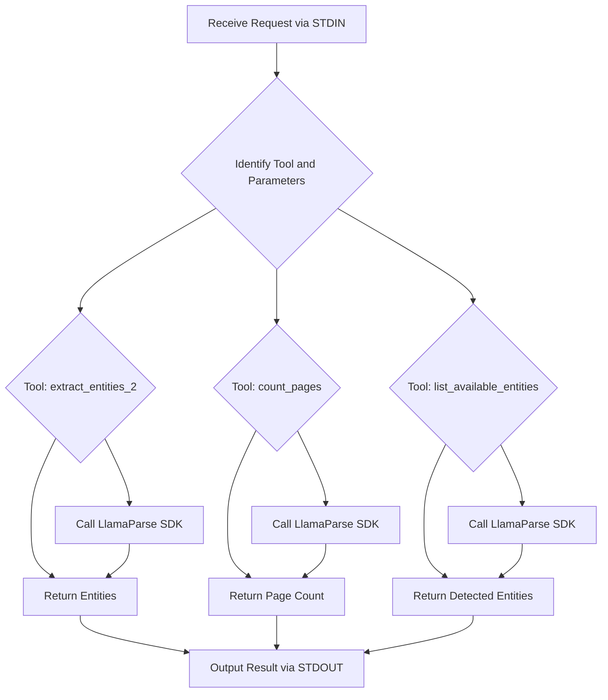

# Second-method - MCP LlamaParse Server

## 🏆 Why I Built This

After experimenting with text and basic entity extraction, I wanted a solution that was both robust and production-ready. This project is my deep dive into using the LlamaParse SDK for advanced PDF processing, with support for markdown output, streaming, and even Gemini-powered normalization. If you want to see how to build a real-world, high-performance document extraction server, this is it!

---

## 🗂️ Project Structure

```
second-method/
├── server.py           # MCP server using LlamaParse SDK
├── requirements.txt    # Python dependencies
├── README.md           # Documentation
```

---

## 🚀 How to Run This (Step-by-Step)

1. **Clone the repository and install dependencies:**
   ```bash
   pip install -r requirements.txt
   ```
2. **Set up your API keys:**
   - Add your LlamaParse API key (and optionally Gemini API key) to a `.env` file:
     ```env
     LLAMA_CLOUD_API_KEY=your_llamaparse_api_key_here
     GEMINI_API_KEY=your_gemini_api_key_here  # Optional, for markdown normalization
     ```
3. **Start the server:**
   ```bash
   python server.py
   ```
4. **Test it!**
   - Send a request like:
     ```json
     {
       "tool": "extract_entities_2",
       "parameters": {
         "pdf_path": "path/to/your/document.pdf",
         "entities": ["invoice number", "total amount"]
       }
     }
     ```
   - You'll get back:
     ```json
     {
       "pages": [
         {
           "page": 1,
           "entities": {
             "invoice number": "INV-123",
             "total amount": "$100.00"
           }
         }
       ]
     }
     ```

---

## 🔄 How It Works (Flowchart)

(See the flowcharts below for a high-level overview of how the server processes requests, routes them to the right tool, and returns results.)

---

## 🗺️ Detailed Server Process Flow (Flowchart)

Below is a flowchart illustrating the server's process flow, rendered using Mermaid syntax. View this README on a platform that supports Mermaid (like GitHub) to see the diagram.



---

## 🛠️ What Tools Are Included?

- **extract_entities_2**: Extracts specified entities from a PDF (by file path or base64). Optionally normalizes markdown using Gemini if configured.
- **count_pages**: Returns the total number of pages in the PDF.
- **list_available_entities**: Lists candidate entity names detected in the PDF.

All tools accept either a `pdf_path` or a `pdf_base64` string as input.

---

## 💡 What You'll Learn
- How to use markdown to preserve document structure
- How to extract entities more reliably
- How HTTP streaming improves tool performance
- How to handle both file path and base64 PDF input

## 🧑‍💻 Why This Matters
This level finally solved the spacing and misalignment headaches I had before. Now, my entity extraction is accurate and fast, and the server is ready for real-world use!

---

## 🙌 Ready to Learn or Contribute?

If you’ve made it this far—thank you! I built this project to help others learn, experiment, and build real solutions. Whether you’re a total beginner or an experienced developer, your questions and contributions are always welcome.

**Next Steps:**
- Try running the server and see what you can build.
- If you get stuck, open an issue or reach out—I'm happy to help!
- Want to add a new feature or fix a bug? Fork the repo and send a pull request.

Let’s make document processing easier, together! 
